# 🌱 Complete Guide to Core Spring & Spring Boot

> **A comprehensive guide covering every aspect of Spring Framework and Spring Boot with detailed explanations, diagrams, and interview questions**

---

## 🚀 Introduction to Spring Framework

### What is Spring Framework?

Spring Framework is a comprehensive, enterprise-grade framework for building Java applications. It provides a programming and configuration model for modern Java-based enterprise applications.

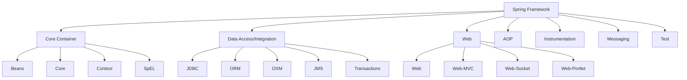

### Key Features of Spring Framework

1. **Lightweight**: Spring is lightweight in terms of size and functionality
2. **Inversion of Control (IoC)**: Objects define their dependencies through constructor arguments, factory method arguments, or properties
3. **Aspect-Oriented Programming (AOP)**: Separates cross-cutting concerns from business logic
4. **Container**: Spring contains and manages the lifecycle and configuration of application objects
5. **MVC Framework**: Provides a robust web MVC framework
6. **Transaction Management**: Provides generic abstraction layer for transaction management
7. **JDBC Exception Handling**: Provides a JDBC abstraction layer that eliminates verbose JDBC coding

### Spring Framework Architecture

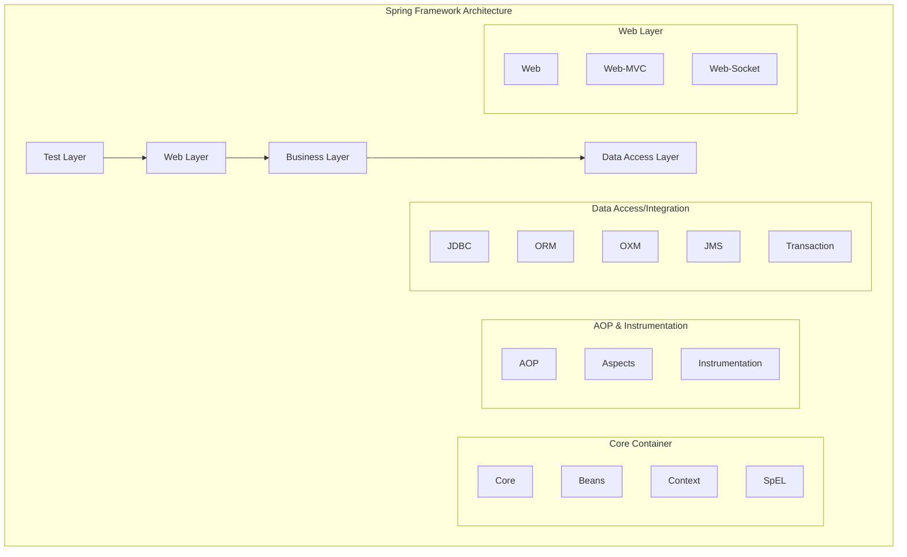

### Interview Questions - Introduction

**Q1: What is Spring Framework and what are its main benefits?**

**Answer:** Spring Framework is a comprehensive application framework for Java that provides:

- **IoC Container**: Manages object lifecycle and dependencies
- **AOP Support**: Enables separation of cross-cutting concerns
- **Data Access Integration**: Simplifies database operations
- **MVC Framework**: Robust web application development
- **Transaction Management**: Declarative transaction support
- **Testing Support**: Comprehensive testing utilities
- **Loose Coupling**: Promotes loose coupling through dependency injection
- **Easy Testing**: Makes unit testing easier with dependency injection

**Q2: What are the different modules in Spring Framework?**

**Answer:** Spring Framework consists of several modules:

1. **Core Container**: Beans, Core, Context, SpEL
2. **Data Access/Integration**: JDBC, ORM, OXM, JMS, Transaction
3. **Web**: Web, Web-MVC, Web-Socket, Web-Portlet
4. **AOP**: Aspect-Oriented Programming support
5. **Instrumentation**: Class instrumentation support
6. **Messaging**: Message-based applications support
7. **Test**: Testing support with TestContext framework

---

## 🔄 Core Spring Concepts

### The Spring Triangle

Spring Framework is built on three core concepts that form the "Spring Triangle":

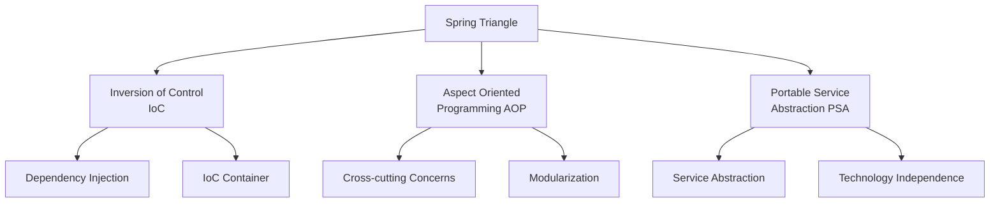

### 1. Inversion of Control (IoC)

IoC is a design principle where the control of object creation and management is transferred from the application code to an external container.

**Traditional Approach vs IoC:**

```java
// Traditional Approach (Tight Coupling)
public class OrderService {
    private PaymentService paymentService = new PaymentService(); // Tight coupling

    public void processOrder(Order order) {
        paymentService.processPayment(order.getAmount());
    }
}

// IoC Approach (Loose Coupling)
public class OrderService {
    private PaymentService paymentService; // Dependency

    // Constructor Injection
    public OrderService(PaymentService paymentService) {
        this.paymentService = paymentService;
    }

    public void processOrder(Order order) {
        paymentService.processPayment(order.getAmount());
    }
}
```

### 2. Dependency Injection (DI)

DI is a technique for implementing IoC where dependencies are injected into objects rather than objects creating their dependencies.

**Types of Dependency Injection:**

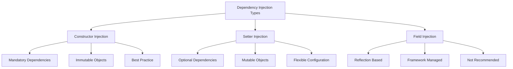

**Constructor Injection Example:**

```java
@Component
public class UserService {
    private final UserRepository userRepository;
    private final EmailService emailService;

    // Constructor injection - recommended approach
    public UserService(UserRepository userRepository, EmailService emailService) {
        this.userRepository = userRepository;
        this.emailService = emailService;
    }

    public User createUser(String email) {
        User user = new User(email);
        userRepository.save(user);
        emailService.sendWelcomeEmail(user);
        return user;
    }
}
```

**Setter Injection Example:**

```java
@Component
public class NotificationService {
    private EmailService emailService;
    private SmsService smsService;

    @Autowired
    public void setEmailService(EmailService emailService) {
        this.emailService = emailService;
    }

    @Autowired(required = false) // Optional dependency
    public void setSmsService(SmsService smsService) {
        this.smsService = smsService;
    }
}
```

**Field Injection Example (Not Recommended):**

```java
@Component
public class ProductService {
    @Autowired
    private ProductRepository productRepository; // Field injection

    @Autowired
    private PriceService priceService;
}
```

### Interview Questions - Core Concepts

**Q1: What is Inversion of Control (IoC) and how does it benefit application design?**

**Answer:** IoC is a design principle where the control of object creation and dependency management is inverted from the application code to an external container (Spring IoC Container). Benefits include:

- **Loose Coupling**: Objects don't create their dependencies directly
- **Testability**: Easy to mock dependencies for unit testing
- **Flexibility**: Easy to change implementations without modifying code
- **Maintainability**: Centralized dependency management
- **Reusability**: Components can be reused with different dependencies

**Q2: What are the different types of Dependency Injection and when should each be used?**

**Answer:** There are three types of DI:

1. **Constructor Injection** (Recommended):
    - Use for mandatory dependencies
    - Creates immutable objects
    - Enables fail-fast behavior
    - Better for testing

2. **Setter Injection**:
    - Use for optional dependencies
    - Allows circular dependencies (though not recommended)
    - More readable for many dependencies

3. **Field Injection** (Not Recommended):
    - Convenient but creates tight coupling to Spring
    - Harder to test
    - Cannot create immutable objects
    - Hidden dependencies

**Q3: What is the difference between IoC and Dependency Injection?**

**Answer:**

- **IoC** is a design principle/concept where control is inverted from the application to the framework
- **Dependency Injection** is a specific technique/pattern to implement IoC
- IoC is the broader concept, DI is one way to achieve IoC
- Other IoC techniques include
    - `Factory pattern`
    - `Event-based IoC`
        - Spring provides an ApplicationEventPublisher and event listeners.
        - Beans can publish and listen to events instead of calling each other directly → IoC via event delegation.
    - `Template Method Pattern1` (IoC via Callbacks)
        - Spring provides template classes like:
            - `JdbcTemplate`
            - `RestTemplate` (deprecated, but used earlier)
            - `TransactionTemplate`
        - You just provide the callback (business logic), and Spring controls the flow (connection management, transactions, etc.).

    - `Service Locator Pattern`
        - Instead of injecting dependencies, beans look them up using a Spring-provided `ApplicationContext` or `ServiceLocatorFactoryBean`.
        - Less preferred than DI, but still IoC.

---

## 🏗️ Spring IoC Container

### What is Spring IoC Container?

The Spring IoC Container is the core of Spring Framework. It creates objects, configures them, and manages their complete lifecycle.

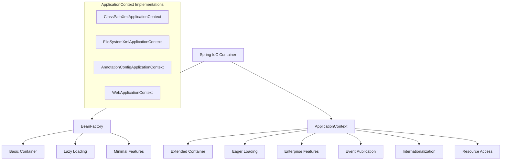

### BeanFactory vs ApplicationContext

| Feature                 | BeanFactory              | ApplicationContext      |
| ----------------------- | ------------------------ | ----------------------- |
| Bean Instantiation      | Lazy (on-demand)         | Eager (startup time)    |
| Bean Post Processing    | Manual registration      | Automatic               |
| Event Publication       | Not supported            | Supported               |
| Internationalization    | Not supported            | Supported               |
| Resource Access         | Not supported            | Supported               |
| Environment Abstraction | Not supported            | Supported               |
| Usage                   | Lightweight applications | Enterprise applications |

### Container Lifecycle

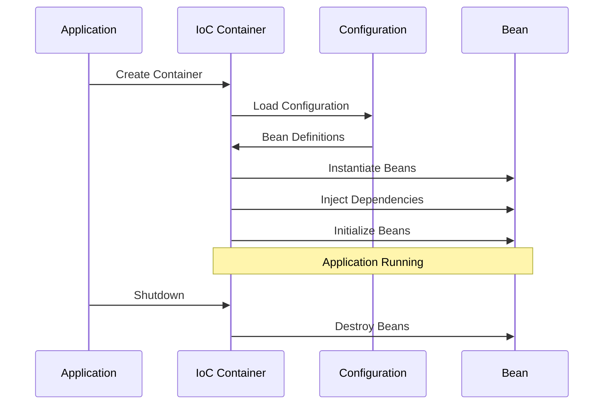

### Configuration Approaches

#### 1. XML-Based Configuration

```xml
<?xml version="1.0" encoding="UTF-8"?>
<beans xmlns="http://www.springframework.org/schema/beans"
       xmlns:xsi="http://www.w3.org/2001/XMLSchema-instance"
       xsi:schemaLocation="
        http://www.springframework.org/schema/beans
        http://www.springframework.org/schema/beans/spring-beans.xsd">

    <!-- Simple Bean Definition -->
    <bean id="userService" class="com.example.UserService">
        <constructor-arg ref="userRepository"/>
        <constructor-arg ref="emailService"/>
    </bean>

    <!-- Bean with Properties -->
    <bean id="dataSource" class="com.example.DataSource">
        <property name="url" value="jdbc:mysql://localhost:3306/mydb"/>
        <property name="username" value="user"/>
        <property name="password" value="password"/>
    </bean>

    <!-- Singleton vs Prototype -->
    <bean id="singletonBean" class="com.example.SingletonBean" scope="singleton"/>
    <bean id="prototypeBean" class="com.example.PrototypeBean" scope="prototype"/>
</beans>
```

#### 2. Annotation-Based Configuration

```java
@Configuration
@ComponentScan(basePackages = "com.example")
@EnableTransactionManagement
public class AppConfig {

    @Bean
    @Primary
    public DataSource dataSource() {
        HikariDataSource dataSource = new HikariDataSource();
        dataSource.setJdbcUrl("jdbc:mysql://localhost:3306/mydb");
        dataSource.setUsername("user");
        dataSource.setPassword("password");
        dataSource.setMaximumPoolSize(20);
        return dataSource;
    }

    @Bean
    @Conditional(DatabaseCondition.class)
    public UserRepository userRepository(DataSource dataSource) {
        return new JdbcUserRepository(dataSource);
    }

    @Bean
    @Profile("production")
    public EmailService emailService() {
        return new SmtpEmailService();
    }

    @Bean
    @Profile("development")
    public EmailService mockEmailService() {
        return new MockEmailService();
    }
}
```

#### 3. Java-Based Configuration

```java
@Service
public class UserService {
    private final UserRepository userRepository;
    private final EmailService emailService;

    // Constructor injection
    public UserService(UserRepository userRepository, EmailService emailService) {
        this.userRepository = userRepository;
        this.emailService = emailService;
    }
}

@Repository
public class JdbcUserRepository implements UserRepository {
    private final JdbcTemplate jdbcTemplate;

    public JdbcUserRepository(JdbcTemplate jdbcTemplate) {
        this.jdbcTemplate = jdbcTemplate;
    }
}

@Component
@ConditionalOnProperty(name = "email.enabled", havingValue = "true")
public class EmailService {
    @Value("${email.smtp.host}")
    private String smtpHost;

    @Value("${email.smtp.port:587}")
    private int smtpPort;
}
```

### Container Initialization

```java
// XML Configuration
ApplicationContext context = new ClassPathXmlApplicationContext("applicationContext.xml");

// Annotation Configuration
ApplicationContext context = new AnnotationConfigApplicationContext(AppConfig.class);

// Multiple Configuration Classes
ApplicationContext context = new AnnotationConfigApplicationContext(
    AppConfig.class,
    DatabaseConfig.class,
    SecurityConfig.class
);

// Getting Beans from Container
UserService userService = context.getBean(UserService.class);
UserService userService = (UserService) context.getBean("userService");
UserService userService = context.getBean("userService", UserService.class);
```

### Interview Questions - IoC Container

**Q1: What is the difference between BeanFactory and ApplicationContext?**

**Answer:**
| Aspect | BeanFactory | ApplicationContext |
|--------|-------------|-------------------|
| Loading | Lazy loading of beans | Eager loading of beans |
| Features | Basic IoC features | Extended enterprise features |
| Post Processing | Manual registration required | Automatic post-processor detection |
| Event Handling | Not supported | Application event publication |
| Internationalization | Not supported | Message source integration |
| Resource Loading | Not supported | Resource loading abstraction |
| Environment | Not supported | Environment and profile support |
| Usage | Resource-constrained environments | Enterprise applications |

**Q2: How do you create and configure Spring IoC Container?**

**Answer:** There are multiple ways to create Spring IoC Container:

1. **XML Configuration**:

```java
ApplicationContext context = new ClassPathXmlApplicationContext("applicationContext.xml");
```

2. **Java Configuration**:

```java
ApplicationContext context = new AnnotationConfigApplicationContext(AppConfig.class);
```

3. **Component Scanning**:

```java
@Configuration
@ComponentScan("com.example")
public class AppConfig {}
```

4. **Web Application Context**:

```java
// Automatically created by Spring in web applications
@EnableWebMvc
@Configuration
public class WebConfig implements WebMvcConfigurer {}
```

**Q3: What happens during Spring Container startup and shutdown?**

**Answer:**

**Container Startup:**

1. Load configuration metadata (XML/Java/Annotations)
2. Create bean definitions registry
3. Instantiate beans (singleton scope)
4. Inject dependencies
5. Call initialization callbacks
6. Container ready for use

**Container Shutdown:**

1. Publish context closed event
2. Call destruction callbacks on singleton beans
3. Release resources
4. Container destroyed

---

## 🔧 Bean Management

### Bean Lifecycle

Understanding bean lifecycle is crucial for proper resource management and initialization/destruction callbacks.

<div align = "center">

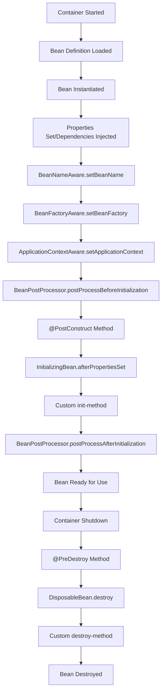

</div>

### Complete Bean Lifecycle Example

```java
@Component
public class LifecycleDemoBean implements BeanNameAware, BeanFactoryAware,
    ApplicationContextAware, InitializingBean, DisposableBean {

    private String beanName;
    private BeanFactory beanFactory;
    private ApplicationContext applicationContext;

    public LifecycleDemoBean() {
        System.out.println("1. Bean Constructor called");
    }

    @Override
    public void setBeanName(String name) {
        this.beanName = name;
        System.out.println("2. BeanNameAware.setBeanName() called with: " + name);
    }

    @Override
    public void setBeanFactory(BeanFactory beanFactory) throws BeansException {
        this.beanFactory = beanFactory;
        System.out.println("3. BeanFactoryAware.setBeanFactory() called");
    }

    @Override
    public void setApplicationContext(ApplicationContext applicationContext) throws BeansException {
        this.applicationContext = applicationContext;
        System.out.println("4. ApplicationContextAware.setApplicationContext() called");
    }

    @PostConstruct
    public void postConstruct() {
        System.out.println("5. @PostConstruct method called");
    }

    @Override
    public void afterPropertiesSet() throws Exception {
        System.out.println("6. InitializingBean.afterPropertiesSet() called");
    }

    // Custom initialization method
    public void customInit() {
        System.out.println("7. Custom init method called");
    }

    @PreDestroy
    public void preDestroy() {
        System.out.println("8. @PreDestroy method called");
    }

    @Override
    public void destroy() throws Exception {
        System.out.println("9. DisposableBean.destroy() called");
    }

    // Custom destruction method
    public void customDestroy() {
        System.out.println("10. Custom destroy method called");
    }
}
```

### Bean Post Processor

```java
@Component
public class CustomBeanPostProcessor implements BeanPostProcessor {

    @Override
    public Object postProcessBeforeInitialization(Object bean, String beanName)
            throws BeansException {
        if (bean instanceof LifecycleDemoBean) {
            System.out.println("BeanPostProcessor: Before initialization of " + beanName);
        }
        return bean;
    }

    @Override
    public Object postProcessAfterInitialization(Object bean, String beanName)
            throws BeansException {
        if (bean instanceof LifecycleDemoBean) {
            System.out.println("BeanPostProcessor: After initialization of " + beanName);
        }
        return bean;
    }
}
```

### Bean Scopes

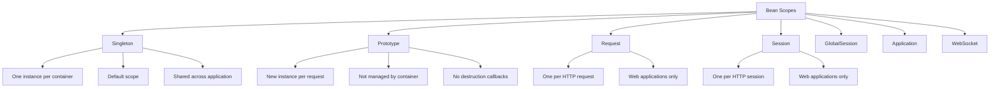

#### Scope Examples

```java
// Singleton Scope (Default)
@Component
@Scope("singleton")
public class SingletonService {
    // Only one instance created
}

// Prototype Scope
@Component
@Scope("prototype")
public class PrototypeService {
    // New instance for each request
}

// Request Scope (Web applications)
@Component
@Scope("request")
public class RequestScopedService {
    // New instance per HTTP request
}

// Session Scope (Web applications)
@Component
@Scope("session")
public class SessionScopedService {
    // New instance per HTTP session
}

// Custom Scope
@Component
@Scope("custom")
public class CustomScopedService {
    // Custom scope implementation
}
```

### Bean Definition and Registration

```java
@Configuration
public class BeanConfig {

    // Simple bean definition
    @Bean
    public UserService userService() {
        return new UserService();
    }

    // Bean with dependencies
    @Bean
    public OrderService orderService(UserService userService, PaymentService paymentService) {
        return new OrderService(userService, paymentService);
    }

    // Bean with initialization and destruction methods
    @Bean(initMethod = "init", destroyMethod = "cleanup")
    public ConnectionPool connectionPool() {
        return new ConnectionPool();
    }

    // Conditional bean
    @Bean
    @ConditionalOnProperty(name = "feature.enabled", havingValue = "true")
    public FeatureService featureService() {
        return new FeatureService();
    }

    // Primary bean (when multiple beans of same type exist)
    @Bean
    @Primary
    public PaymentService primaryPaymentService() {
        return new CreditCardPaymentService();
    }

    // Qualified bean
    @Bean
    @Qualifier("paypal")
    public PaymentService paypalPaymentService() {
        return new PayPalPaymentService();
    }
}
```

### Bean Validation and Constraints

```java
@Component
@Validated
public class UserService {

    @Autowired
    public void createUser(@Valid @NotNull User user) {
        // Method will validate user parameter
    }

    @EventListener
    @Async
    public void handleUserCreated(@Valid UserCreatedEvent event) {
        // Event handling with validation
    }
}

@Component
public class User {
    @NotBlank(message = "Name cannot be blank")
    private String name;

    @Email(message = "Invalid email format")
    private String email;

    @Min(value = 18, message = "Age must be at least 18")
    private int age;

    // Constructor, getters, setters
}
```

### Interview Questions - Bean Management

**Q1: Explain the complete lifecycle of a Spring Bean.**

**Answer:** The Spring Bean lifecycle consists of several phases:

1. **Instantiation**: Container creates bean instance using constructor
2. **Property Setting**: Dependencies are injected via setters or fields
3. **Aware Interfaces**: Container calls aware interfaces (BeanNameAware, BeanFactoryAware, etc.)
4. **BeanPostProcessor**: `postProcessBeforeInitialization()` called
5. **Initialization**:
    - `@PostConstruct` methods called
    - `InitializingBean.afterPropertiesSet()` called
    - Custom `init-method` called
6. **BeanPostProcessor**: `postProcessAfterInitialization()` called
7. **Ready for Use**: Bean is ready for application use
8. **Destruction** (on container shutdown):
    - `@PreDestroy` methods called
    - `DisposableBean.destroy()` called
    - Custom `destroy-method` called

**Q2: What are the different bean scopes in Spring and when to use each?**

**Answer:** Spring provides several bean scopes:

1. **Singleton** (default): One instance per container
    - Use for stateless services, DAOs, configuration beans
2. **Prototype**: New instance for each request
    - Use for stateful beans, beans with user-specific data
3. **Request**: One instance per HTTP request (web only)
    - Use for request-specific data processing
4. **Session**: One instance per HTTP session (web only)
    - Use for user session data, shopping carts
5. **GlobalSession**: One instance per global HTTP session (portlet)
    - Use in portlet applications
6. **Application**: One instance per ServletContext (web only)
    - Use for application-wide shared data

**Q3: How do you handle circular dependencies in Spring?**

**Answer:** Spring handles circular dependencies in several ways:

1. **Constructor Injection**: Spring cannot resolve circular dependencies with constructor injection and throws `BeanCurrentlyInCreationException`

2. **Setter Injection**: Spring can resolve circular dependencies using setter injection by creating beans first and then setting properties

3. **@Lazy Annotation**: Use `@Lazy` to defer initialization

```java
@Component
public class BeanA {
    private BeanB beanB;

    public BeanA(@Lazy BeanB beanB) {
        this.beanB = beanB;
    }
}
```

4. **Best Practices**:
    - Redesign architecture to avoid circular dependencies
    - Use interfaces and event-driven architecture
    - Consider using `ApplicationEventPublisher` for decoupling

---

## 🎯 Aspect-Oriented Programming (AOP)

### Introduction to AOP

AOP enables modularization of cross-cutting concerns that span multiple classes and layers of an application.

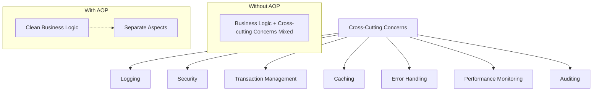

### AOP Terminology

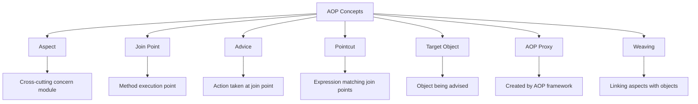

### Types of Advice

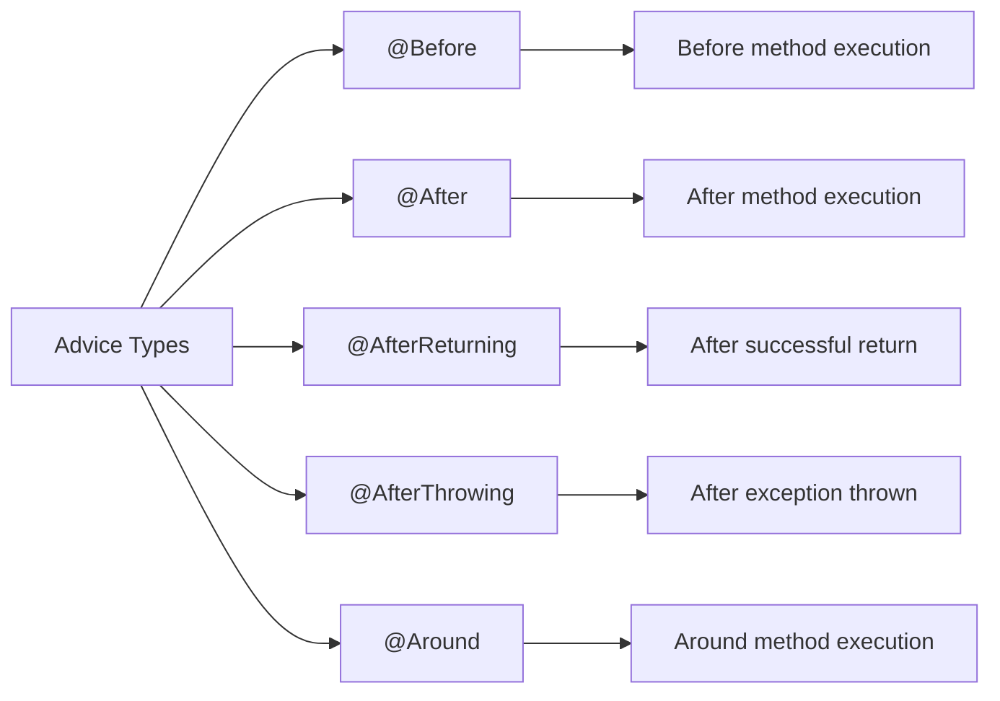

### Complete AOP Example

#### 1. Logging Aspect

```java
@Aspect
@Component
@Slf4j
public class LoggingAspect {

    // Pointcut for all service methods
    @Pointcut("execution(* com.example.service.*.*(..))")
    public void serviceLayer() {}

    // Pointcut for all repository methods
    @Pointcut("execution(* com.example.repository.*.*(..))")
    public void repositoryLayer() {}

    // Combined pointcut
    @Pointcut("serviceLayer() || repositoryLayer()")
    public void applicationLayer() {}

    @Before("applicationLayer()")
    public void logMethodEntry(JoinPoint joinPoint) {
        String methodName = joinPoint.getSignature().getName();
        String className = joinPoint.getTarget().getClass().getSimpleName();
        Object[] args = joinPoint.getArgs();

        log.info("Entering method: {}.{} with arguments: {}",
                className, methodName, Arrays.toString(args));
    }

    @AfterReturning(pointcut = "applicationLayer()", returning = "result")
    public void logMethodReturn(JoinPoint joinPoint, Object result) {
        String methodName = joinPoint.getSignature().getName();
        String className = joinPoint.getTarget().getClass().getSimpleName();

        log.info("Method {}.{} returned: {}",
                className, methodName, result);
    }

    @AfterThrowing(pointcut = "applicationLayer()", throwing = "exception")
    public void logMethodException(JoinPoint joinPoint, Exception exception) {
        String methodName = joinPoint.getSignature().getName();
        String className = joinPoint.getTarget().getClass().getSimpleName();

        log.error("Method {}.{} threw exception: {}",
                className, methodName, exception.getMessage());
    }

    @Around("serviceLayer()")
    public Object logExecutionTime(ProceedingJoinPoint proceedingJoinPoint) throws Throwable {
        long startTime = System.currentTimeMillis();

        try {
            Object result = proceedingJoinPoint.proceed();
            long endTime = System.currentTimeMillis();

            String methodName = proceedingJoinPoint.getSignature().getName();
            log.info("Method {} executed in {} ms", methodName, (endTime - startTime));

            return result;
        } catch (Exception e) {
            long endTime = System.currentTimeMillis();
            String methodName = proceedingJoinPoint.getSignature().getName();
            log.info("Method {} failed after {} ms", methodName, (endTime - startTime));
            throw e;
        }
    }
}
```

#### 2. Security Aspect

```java
@Aspect
@Component
public class SecurityAspect {

    @Autowired
    private SecurityService securityService;

    @Pointcut("@annotation(com.example.annotation.Secured)")
    public void securedMethod() {}

    @Before("securedMethod() && @annotation(secured)")
    public void checkSecurity(JoinPoint joinPoint, Secured secured) {
        String[] roles = secured.roles();
        String currentUser = securityService.getCurrentUser();

        if (!securityService.hasAnyRole(currentUser, roles)) {
            throw new SecurityException("Access denied for user: " + currentUser);
        }

        log.info("Security check passed for user: {} on method: {}",
                currentUser, joinPoint.getSignature().getName());
    }
}

// Custom annotation
@Target(ElementType.METHOD)
@Retention(RetentionPolicy.RUNTIME)
public @interface Secured {
    String[] roles() default {};
}

// Usage
@Service
public class UserService {

    @Secured(roles = {"ADMIN", "USER_MANAGER"})
    public User createUser(User user) {
        // Method implementation
        return userRepository.save(user);
    }

    @Secured(roles = {"ADMIN"})
    public void deleteUser(Long userId) {
        // Method implementation
        userRepository.deleteById(userId);
    }
}
```

#### 3. Caching Aspect

```java
@Aspect
@Component
public class CachingAspect {

    private final Map<String, Object> cache = new ConcurrentHashMap<>();

    @Pointcut("@annotation(com.example.annotation.Cacheable)")
    public void cacheableMethod() {}

    @Around("cacheableMethod() && @annotation(cacheable)")
    public Object cacheResult(ProceedingJoinPoint joinPoint, Cacheable cacheable) throws Throwable {
        String cacheKey = generateCacheKey(joinPoint, cacheable.key());

        // Check if result is in cache
        if (cache.containsKey(cacheKey)) {
            log.info("Cache hit for key: {}", cacheKey);
            return cache.get(cacheKey);
        }

        // Execute method and cache result
        Object result = joinPoint.proceed();
        cache.put(cacheKey, result);
        log.info("Cache miss for key: {}. Result cached.", cacheKey);

        return result;
    }

    private String generateCacheKey(ProceedingJoinPoint joinPoint, String keyExpression) {
        String methodName = joinPoint.getSignature().getName();
        Object[] args = joinPoint.getArgs();

        if (keyExpression.isEmpty()) {
            return methodName + ":" + Arrays.toString(args);
        } else {
            // Simple key expression evaluation
            return keyExpression + ":" + Arrays.toString(args);
        }
    }
}

@Target(ElementType.METHOD)
@Retention(RetentionPolicy.RUNTIME)
public @interface Cacheable {
    String key() default "";
}
```

### Pointcut Expressions

```java
@Aspect
@Component
public class PointcutExamples {

    // Method execution
    @Pointcut("execution(* com.example.service.*.*(..))")
    public void allServiceMethods() {}

    // Specific method
    @Pointcut("execution(* com.example.service.UserService.findById(..))")
    public void userServiceFindById() {}

    // Methods with specific annotation
    @Pointcut("@annotation(org.springframework.transaction.annotation.Transactional)")
    public void transactionalMethods() {}

    // Classes with specific annotation
    @Pointcut("@within(org.springframework.stereotype.Service)")
    public void serviceClasses() {}

    // Methods with specific parameters
    @Pointcut("execution(* com.example.service.*.*(java.lang.String, ..))")
    public void methodsWithStringFirstParam() {}

    // Methods returning specific type
    @Pointcut("execution(com.example.model.User com.example.service.*.*(..))")
    public void methodsReturningUser() {}

    // Bean name matching
    @Pointcut("bean(*Service)")
    public void serviceBeans() {}

    // Combining pointcuts
    @Pointcut("allServiceMethods() && transactionalMethods()")
    public void transactionalServiceMethods() {}
}
```

### AOP Configuration

```java
@Configuration
@EnableAspectJAutoProxy
@ComponentScan("com.example")
public class AopConfig {

    // Enable AOP with CGLIB proxies
    @Bean
    public AopAutoProxyCreator aopAutoProxyCreator() {
        AopAutoProxyCreator proxyCreator = new AopAutoProxyCreator();
        proxyCreator.setProxyTargetClass(true);
        return proxyCreator;
    }
}
```

### Proxy Mechanisms

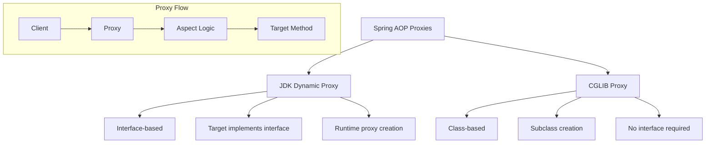

### Interview Questions - AOP

**Q1: What is Aspect-Oriented Programming and how does it benefit application design?**

**Answer:** AOP is a programming paradigm that allows modularization of cross-cutting concerns. Benefits include:

- **Separation of Concerns**: Business logic separated from cross-cutting concerns
- **Code Reusability**: Aspects can be applied to multiple classes/methods
- **Maintainability**: Changes to cross-cutting logic in one place
- **Cleaner Code**: Business logic not cluttered with infrastructure code
- **Declarative**: Configuration-based approach using annotations

Common cross-cutting concerns: logging, security, transactions, caching, error handling, performance monitoring.

**Q2: Explain different types of advice in Spring AOP with examples.**

**Answer:**

1. **@Before**: Executes before method execution

```java
@Before("execution(* com.example.service.*.*(..))")
public void logBefore(JoinPoint joinPoint) {
    // Executed before method
}
```

2. **@After**: Executes after method execution (regardless of outcome)

```java
@After("execution(* com.example.service.*.*(..))")
public void logAfter(JoinPoint joinPoint) {
    // Executed after method (finally block)
}
```

3. **@AfterReturning**: Executes after successful method return

```java
@AfterReturning(pointcut = "execution(* com.example.service.*.*(..))", returning = "result")
public void logAfterReturning(JoinPoint joinPoint, Object result) {
    // Executed after successful return
}
```

4. **@AfterThrowing**: Executes after method throws exception

```java
@AfterThrowing(pointcut = "execution(* com.example.service.*.*(..))", throwing = "exception")
public void logAfterThrowing(JoinPoint joinPoint, Exception exception) {
    // Executed when exception thrown
}
```

5. **@Around**: Most powerful - can control method execution

```java
@Around("execution(* com.example.service.*.*(..))")
public Object logAround(ProceedingJoinPoint joinPoint) throws Throwable {
    // Before method
    Object result = joinPoint.proceed(); // Execute method
    // After method
    return result;
}
```

**Q3: What's the difference between JDK Dynamic Proxy and CGLIB Proxy?**

**Answer:**

| Aspect        | JDK Dynamic Proxy               | CGLIB Proxy                                        |
| ------------- | ------------------------------- | -------------------------------------------------- |
| Requirement   | Target must implement interface | No interface required                              |
| Creation      | Runtime proxy creation          | Subclass creation at runtime                       |
| Performance   | Faster proxy creation           | Slower proxy creation, faster execution            |
| Limitation    | Only interface methods proxied  | Cannot proxy final methods/classes                 |
| Default       | Used when interface available   | Used for classes without interfaces                |
| Configuration | `@EnableAspectJAutoProxy`       | `@EnableAspectJAutoProxy(proxyTargetClass = true)` |

Spring automatically chooses proxy type based on target object, but you can force CGLIB using `proxyTargetClass = true`.

---

## 🌐 Spring MVC

### Introduction to Spring MVC

Spring MVC is a web framework built on the Servlet API and follows the Model-View-Controller design pattern.

<div align = "center">

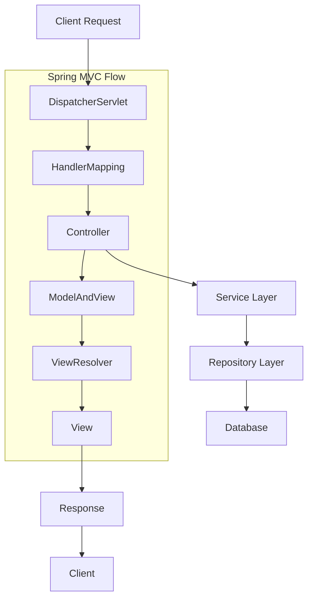

</div>

### Spring MVC Architecture

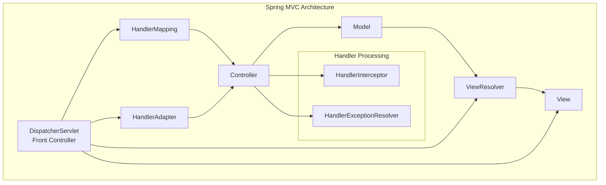

### Complete Spring MVC Configuration

#### 1. Java Configuration

```java
@Configuration
@EnableWebMvc
@ComponentScan("com.example")
public class WebConfig implements WebMvcConfigurer {

    // View Resolver Configuration
    @Bean
    public ViewResolver viewResolver() {
        InternalResourceViewResolver resolver = new InternalResourceViewResolver();
        resolver.setPrefix("/WEB-INF/views/");
        resolver.setSuffix(".jsp");
        resolver.setViewClass(JstlView.class);
        return resolver;
    }

    // Resource Handling
    @Override
    public void addResourceHandlers(ResourceHandlerRegistry registry) {
        registry.addResourceHandler("/static/**")
                .addResourceLocations("/static/")
                .setCachePeriod(31556926);

        registry.addResourceHandler("/webjars/**")
                .addResourceLocations("/webjars/")
                .resourceChain(false);
    }

    // Interceptors
    @Override
    public void addInterceptors(InterceptorRegistry registry) {
        registry.addInterceptor(new LoggingInterceptor())
                .addPathPatterns("/**")
                .excludePathPatterns("/static/**", "/webjars/**");

        registry.addInterceptor(new AuthenticationInterceptor())
                .addPathPatterns("/admin/**")
                .order(1);
    }

    // CORS Configuration
    @Override
    public void addCorsMappings(CorsRegistry registry) {
        registry.addMapping("/api/**")
                .allowedOrigins("http://localhost:3000")
                .allowedMethods("GET", "POST", "PUT", "DELETE")
                .allowedHeaders("*")
                .allowCredentials(true)
                .maxAge(3600);
    }

    // Message Converters
    @Override
    public void configureMessageConverters(List<HttpMessageConverter<?>> converters) {
        Jackson2ObjectMapperBuilder builder = new Jackson2ObjectMapperBuilder()
                .indentOutput(true)
                .dateFormat(new SimpleDateFormat("yyyy-MM-dd HH:mm:ss"));

        converters.add(new MappingJackson2HttpMessageConverter(builder.build()));
    }

    // Exception Handling
    @Bean
    public SimpleMappingExceptionResolver exceptionResolver() {
        SimpleMappingExceptionResolver resolver = new SimpleMappingExceptionResolver();
        Properties mappings = new Properties();
        mappings.put("DataAccessException", "error/database-error");
        mappings.put("SecurityException", "error/access-denied");
        resolver.setExceptionMappings(mappings);
        resolver.setDefaultErrorView("error/general-error");
        return resolver;
    }
}
```

#### 2. Controllers

```java
@RestController
@RequestMapping("/api/users")
@Validated
public class UserController {

    private final UserService userService;

    public UserController(UserService userService) {
        this.userService = userService;
    }

    // GET - Retrieve all users with pagination
    @GetMapping
    public ResponseEntity<Page<UserDTO>> getAllUsers(
            @RequestParam(defaultValue = "0") int page,
            @RequestParam(defaultValue = "10") int size,
            @RequestParam(defaultValue = "id") String sortBy,
            @RequestParam(defaultValue = "asc") String sortDir) {

        Sort sort = sortDir.equalsIgnoreCase("desc")
            ? Sort.by(sortBy).descending()
            : Sort.by(sortBy).ascending();

        Pageable pageable = PageRequest.of(page, size, sort);
        Page<UserDTO> users = userService.getAllUsers(pageable);

        return ResponseEntity.ok(users);
    }

    // GET - Retrieve user by ID
    @GetMapping("/{id}")
    public ResponseEntity<UserDTO> getUserById(@PathVariable @Min(1) Long id) {
        return userService.getUserById(id)
                .map(user -> ResponseEntity.ok(user))
                .orElse(ResponseEntity.notFound().build());
    }

    // POST - Create new user
    @PostMapping
    @ResponseStatus(HttpStatus.CREATED)
    public ResponseEntity<UserDTO> createUser(@Valid @RequestBody CreateUserRequest request) {
        UserDTO createdUser = userService.createUser(request);

        URI location = ServletUriComponentsBuilder
                .fromCurrentRequest()
                .path("/{id}")
                .buildAndExpand(createdUser.getId())
                .toUri();

        return ResponseEntity.created(location).body(createdUser);
    }

    // PUT - Update user
    @PutMapping("/{id}")
    public ResponseEntity<UserDTO> updateUser(
            @PathVariable @Min(1) Long id,
            @Valid @RequestBody UpdateUserRequest request) {

        return userService.updateUser(id, request)
                .map(user -> ResponseEntity.ok(user))
                .orElse(ResponseEntity.notFound().build());
    }

    // DELETE - Delete user
    @DeleteMapping("/{id}")
    public ResponseEntity<Void> deleteUser(@PathVariable @Min(1) Long id) {
        boolean deleted = userService.deleteUser(id);
        return deleted ? ResponseEntity.noContent().build()
                      : ResponseEntity.notFound().build();
    }

    // PATCH - Partial update
    @PatchMapping("/{id}/status")
    public ResponseEntity<Void> updateUserStatus(
            @PathVariable Long id,
            @RequestParam UserStatus status) {

        userService.updateUserStatus(id, status);
        return ResponseEntity.ok().build();
    }

    // File Upload
    @PostMapping("/{id}/avatar")
    public ResponseEntity<String> uploadAvatar(
            @PathVariable Long id,
            @RequestParam("file") MultipartFile file) {

        if (file.isEmpty()) {
            return ResponseEntity.badRequest().body("File is empty");
        }

        String fileName = userService.uploadAvatar(id, file);
        return ResponseEntity.ok("Avatar uploaded: " + fileName);
    }

    // Search users
    @GetMapping("/search")
    public ResponseEntity<List<UserDTO>> searchUsers(
            @RequestParam String query,
            @RequestParam(required = false) String role,
            @RequestParam(required = false) UserStatus status) {

        UserSearchCriteria criteria = UserSearchCriteria.builder()
                .query(query)
                .role(role)
                .status(status)
                .build();

        List<UserDTO> users = userService.searchUsers(criteria);
        return ResponseEntity.ok(users);
    }
}
```

#### 3. Request/Response DTOs

```java
// User DTO
@Data
@Builder
public class UserDTO {
    private Long id;

    @NotBlank(message = "Email is required")
    @Email(message = "Invalid email format")
    private String email;

    @NotBlank(message = "First name is required")
    @Size(min = 2, max = 50, message = "First name must be between 2 and 50 characters")
    private String firstName;

    @NotBlank(message = "Last name is required")
    @Size(min = 2, max = 50, message = "Last name must be between 2 and 50 characters")
    private String lastName;

    @NotNull(message = "Role is required")
    private UserRole role;

    private UserStatus status;

    @JsonFormat(pattern = "yyyy-MM-dd HH:mm:ss")
    private LocalDateTime createdAt;

    @JsonFormat(pattern = "yyyy-MM-dd HH:mm:ss")
    private LocalDateTime updatedAt;
}

// Create User Request
@Data
@Builder
public class CreateUserRequest {
    @NotBlank(message = "Email is required")
    @Email(message = "Invalid email format")
    private String email;

    @NotBlank(message = "Password is required")
    @Size(min = 8, message = "Password must be at least 8 characters")
    @Pattern(regexp = "^(?=.*[a-z])(?=.*[A-Z])(?=.*\\d)(?=.*[@$!%*?&])[A-Za-z\\d@$!%*?&]",
             message = "Password must contain uppercase, lowercase, digit and special character")
    private String password;

    @NotBlank(message = "First name is required")
    private String firstName;

    @NotBlank(message = "Last name is required")
    private String lastName;

    @NotNull(message = "Role is required")
    private UserRole role;
}
```

### Exception Handling

```java
@RestControllerAdvice
@Slf4j
public class GlobalExceptionHandler {

    // Validation errors
    @ExceptionHandler(MethodArgumentNotValidException.class)
    @ResponseStatus(HttpStatus.BAD_REQUEST)
    public ResponseEntity<ErrorResponse> handleValidationErrors(
            MethodArgumentNotValidException ex) {

        Map<String, String> errors = new HashMap<>();
        ex.getBindingResult().getFieldErrors().forEach(error ->
            errors.put(error.getField(), error.getDefaultMessage())
        );

        ErrorResponse errorResponse = ErrorResponse.builder()
                .timestamp(LocalDateTime.now())
                .status(HttpStatus.BAD_REQUEST.value())
                .error("Validation Failed")
                .message("Invalid input parameters")
                .errors(errors)
                .build();

        return ResponseEntity.badRequest().body(errorResponse);
    }

    // Resource not found
    @ExceptionHandler(ResourceNotFoundException.class)
    @ResponseStatus(HttpStatus.NOT_FOUND)
    public ResponseEntity<ErrorResponse> handleResourceNotFound(
            ResourceNotFoundException ex, HttpServletRequest request) {

        ErrorResponse errorResponse = ErrorResponse.builder()
                .timestamp(LocalDateTime.now())
                .status(HttpStatus.NOT_FOUND.value())
                .error("Resource Not Found")
                .message(ex.getMessage())
                .path(request.getRequestURI())
                .build();

        return ResponseEntity.status(HttpStatus.NOT_FOUND).body(errorResponse);
    }

    // Database errors
    @ExceptionHandler(DataAccessException.class)
    @ResponseStatus(HttpStatus.INTERNAL_SERVER_ERROR)
    public ResponseEntity<ErrorResponse> handleDataAccessException(
            DataAccessException ex, HttpServletRequest request) {

        log.error("Database error occurred", ex);

        ErrorResponse errorResponse = ErrorResponse.builder()
                .timestamp(LocalDateTime.now())
                .status(HttpStatus.INTERNAL_SERVER_ERROR.value())
                .error("Database Error")
                .message("An error occurred while accessing the database")
                .path(request.getRequestURI())
                .build();

        return ResponseEntity.status(HttpStatus.INTERNAL_SERVER_ERROR).body(errorResponse);
    }

    // Generic exception handler
    @ExceptionHandler(Exception.class)
    @ResponseStatus(HttpStatus.INTERNAL_SERVER_ERROR)
    public ResponseEntity<ErrorResponse> handleGenericException(
            Exception ex, HttpServletRequest request) {

        log.error("Unexpected error occurred", ex);

        ErrorResponse errorResponse = ErrorResponse.builder()
                .timestamp(LocalDateTime.now())
                .status(HttpStatus.INTERNAL_SERVER_ERROR.value())
                .error("Internal Server Error")
                .message("An unexpected error occurred")
                .path(request.getRequestURI())
                .build();

        return ResponseEntity.status(HttpStatus.INTERNAL_SERVER_ERROR).body(errorResponse);
    }
}

@Data
@Builder
public class ErrorResponse {
    private LocalDateTime timestamp;
    private int status;
    private String error;
    private String message;
    private String path;
    private Map<String, String> errors;
}
```

### Interceptors

```java
@Component
@Slf4j
public class LoggingInterceptor implements HandlerInterceptor {

    @Override
    public boolean preHandle(HttpServletRequest request,
                           HttpServletResponse response,
                           Object handler) throws Exception {

        String requestId = UUID.randomUUID().toString();
        request.setAttribute("requestId", requestId);

        log.info("[{}] {} {} - Started",
                requestId, request.getMethod(), request.getRequestURI());

        request.setAttribute("startTime", System.currentTimeMillis());
        return true;
    }

    @Override
    public void postHandle(HttpServletRequest request,
                          HttpServletResponse response,
                          Object handler,
                          ModelAndView modelAndView) throws Exception {

        String requestId = (String) request.getAttribute("requestId");
        log.info("[{}] Response status: {}", requestId, response.getStatus());
    }

    @Override
    public void afterCompletion(HttpServletRequest request,
                               HttpServletResponse response,
                               Object handler,
                               Exception ex) throws Exception {

        String requestId = (String) request.getAttribute("requestId");
        long startTime = (Long) request.getAttribute("startTime");
        long executionTime = System.currentTimeMillis() - startTime;

        log.info("[{}] {} {} - Completed in {}ms",
                requestId, request.getMethod(), request.getRequestURI(), executionTime);

        if (ex != null) {
            log.error("[{}] Request failed with exception", requestId, ex);
        }
    }
}
```

### Interview Questions - Spring MVC

**Q1: Explain the Spring MVC request processing flow.**

**Answer:** The Spring MVC request processing flow involves these steps:

1. **Client Request**: Browser sends HTTP request to server
2. **DispatcherServlet**: Front controller receives the request
3. **HandlerMapping**: Maps request to appropriate controller method
4. **HandlerAdapter**: Adapts handler to uniform interface
5. **Controller Execution**: Controller processes business logic
6. **ModelAndView**: Controller returns model and view information
7. **ViewResolver**: Resolves logical view name to actual view
8. **View Rendering**: View renders the response using model data
9. **Response**: Final response sent back to client

**Q2: What are the key components of Spring MVC and their responsibilities?**

**Answer:**

- **DispatcherServlet**: Front controller that handles all requests
- **HandlerMapping**: Maps requests to handler methods
- **Controller**: Handles business logic and returns ModelAndView
- **ViewResolver**: Resolves logical view names to actual view implementations
- **View**: Renders the model data into response
- **Model**: Contains data to be displayed in the view
- **HandlerAdapter**: Adapts different handler types
- **HandlerInterceptor**: Intercepts requests for cross-cutting concerns

**Q3: How do you handle form validation in Spring MVC?**

**Answer:** Spring MVC provides multiple validation approaches:

1. **JSR-303/JSR-380 Bean Validation**:

```java
public class User {
    @NotBlank(message = "Name is required")
    @Size(min = 2, max = 50)
    private String name;

    @Email(message = "Invalid email")
    private String email;
}

@PostMapping("/users")
public String createUser(@Valid @ModelAttribute User user,
                        BindingResult result) {
    if (result.hasErrors()) {
        return "user-form";
    }
    // Process user
    return "redirect:/users";
}
```

2. **Custom Validator**:

```java
@Component
public class UserValidator implements Validator {
    public boolean supports(Class<?> clazz) {
        return User.class.equals(clazz);
    }

    public void validate(Object target, Errors errors) {
        User user = (User) target;
        if (user.getName() == null || user.getName().trim().isEmpty()) {
            errors.rejectValue("name", "name.required");
        }
    }
}
```

---

## 💾 Data Access Layer

### Spring Data Architecture

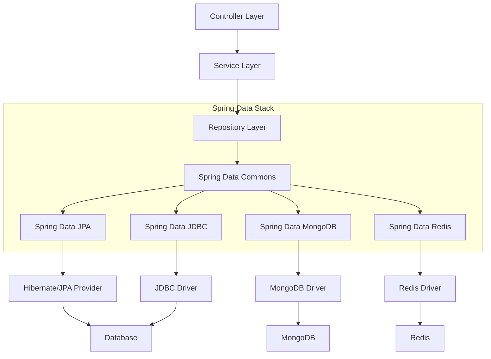

### JPA Configuration

```java
@Configuration
@EnableJpaRepositories(
    basePackages = "com.example.repository",
    entityManagerFactoryRef = "entityManagerFactory",
    transactionManagerRef = "transactionManager"
)
@EnableTransactionManagement
public class JpaConfig {

    @Bean
    @Primary
    @ConfigurationProperties("spring.datasource")
    public DataSource dataSource() {
        return DataSourceBuilder.create()
                .type(HikariDataSource.class)
                .build();
    }

    @Bean
    public LocalContainerEntityManagerFactoryBean entityManagerFactory(
            DataSource dataSource) {

        LocalContainerEntityManagerFactoryBean factory =
            new LocalContainerEntityManagerFactoryBean();

        factory.setDataSource(dataSource);
        factory.setPackagesToScan("com.example.entity");

        HibernateJpaVendorAdapter vendorAdapter = new HibernateJpaVendorAdapter();
        vendorAdapter.setGenerateDdl(true);
        vendorAdapter.setShowSql(true);
        factory.setJpaVendorAdapter(vendorAdapter);

        Properties properties = new Properties();
        properties.setProperty("hibernate.hbm2ddl.auto", "update");
        properties.setProperty("hibernate.dialect", "org.hibernate.dialect.MySQL8Dialect");
        properties.setProperty("hibernate.format_sql", "true");
        properties.setProperty("hibernate.use_sql_comments", "true");
        properties.setProperty("hibernate.jdbc.batch_size", "20");
        properties.setProperty("hibernate.order_inserts", "true");
        properties.setProperty("hibernate.order_updates", "true");
        properties.setProperty("hibernate.jdbc.batch_versioned_data", "true");
        factory.setJpaProperties(properties);

        return factory;
    }

    @Bean
    public PlatformTransactionManager transactionManager(
            EntityManagerFactory entityManagerFactory) {
        JpaTransactionManager transactionManager = new JpaTransactionManager();
        transactionManager.setEntityManagerFactory(entityManagerFactory);
        return transactionManager;
    }

    @Bean
    public JdbcTemplate jdbcTemplate(DataSource dataSource) {
        return new JdbcTemplate(dataSource);
    }

    @Bean
    public NamedParameterJdbcTemplate namedParameterJdbcTemplate(DataSource dataSource) {
        return new NamedParameterJdbcTemplate(dataSource);
    }
}
```

### JPA Entities

```java
@Entity
@Table(name = "users")
@Data
@NoArgsConstructor
@AllArgsConstructor
@Builder
@EntityListeners(AuditingEntityListener.class)
public class User extends BaseEntity {

    @Id
    @GeneratedValue(strategy = GenerationType.IDENTITY)
    private Long id;

    @Column(unique = true, nullable = false)
    @Email
    private String email;

    @Column(nullable = false)
    private String firstName;

    @Column(nullable = false)
    private String lastName;

    @Column(nullable = false)
    private String password;

    @Enumerated(EnumType.STRING)
    private UserRole role;

    @Enumerated(EnumType.STRING)
    private UserStatus status;

    @OneToMany(mappedBy = "user", cascade = CascadeType.ALL, fetch = FetchType.LAZY)
    @JsonIgnore
    private List<Order> orders = new ArrayList<>();

    @OneToOne(mappedBy = "user", cascade = CascadeType.ALL, fetch = FetchType.LAZY)
    private UserProfile profile;

    @ManyToMany(fetch = FetchType.LAZY)
    @JoinTable(
        name = "user_authorities",
        joinColumns = @JoinColumn(name = "user_id"),
        inverseJoinColumns = @JoinColumn(name = "authority_id")
    )
    private Set<Authority> authorities = new HashSet<>();

    // Constructors, equals, hashCode methods
    public User(String email, String firstName, String lastName) {
        this.email = email;
        this.firstName = firstName;
        this.lastName = lastName;
        this.status = UserStatus.ACTIVE;
    }

    @Override
    public boolean equals(Object o) {
        if (this == o) return true;
        if (!(o instanceof User)) return false;
        User user = (User) o;
        return Objects.equals(email, user.email);
    }

    @Override
    public int hashCode() {
        return Objects.hash(email);
    }
}

@MappedSuperclass
@Data
@EntityListeners(AuditingEntityListener.class)
public abstract class BaseEntity {

    @CreatedDate
    @Column(nullable = false, updatable = false)
    private LocalDateTime createdAt;

    @LastModifiedDate
    @Column(nullable = false)
    private LocalDateTime updatedAt;

    @CreatedBy
    @Column(updatable = false)
    private String createdBy;

    @LastModifiedBy
    private String lastModifiedBy;

    @Version
    private Long version;
}
```

### Repository Layer

```java
// Basic Repository
@Repository
public interface UserRepository extends JpaRepository<User, Long>,
                                       JpaSpecificationExecutor<User> {

    // Query Methods
    Optional<User> findByEmail(String email);

    List<User> findByRole(UserRole role);

    List<User> findByStatus(UserStatus status);

    @Query("SELECT u FROM User u WHERE u.firstName LIKE %:name% OR u.lastName LIKE %:name%")
    List<User> findByNameContaining(@Param("name") String name);

    // Native Query
    @Query(value = "SELECT * FROM users u WHERE u.created_at > :date", nativeQuery = true)
    List<User> findUsersCreatedAfter(@Param("date") LocalDateTime date);

    // Modifying Query
    @Modifying
    @Query("UPDATE User u SET u.status = :status WHERE u.id = :id")
    int updateUserStatus(@Param("id") Long id, @Param("status") UserStatus status);

    // Projection
    @Query("SELECT new com.example.dto.UserSummary(u.id, u.firstName, u.lastName, u.email) " +
           "FROM User u WHERE u.status = :status")
    List<UserSummary> findUserSummariesByStatus(@Param("status") UserStatus status);

    // Pagination and Sorting
    Page<User> findByRoleAndStatus(UserRole role, UserStatus status, Pageable pageable);

    // EXISTS query
    boolean existsByEmail(String email);

    // COUNT query
    long countByStatus(UserStatus status);

    // DELETE query
    @Transactional
    @Modifying
    void deleteByStatus(UserStatus status);
}

// Custom Repository Implementation
public interface UserRepositoryCustom {
    List<User> findUsersWithCustomCriteria(UserSearchCriteria criteria);
    Page<User> findUsersWithDynamicQuery(Map<String, Object> filters, Pageable pageable);
}

@Repository
public class UserRepositoryCustomImpl implements UserRepositoryCustom {

    @PersistenceContext
    private EntityManager entityManager;

    @Override
    public List<User> findUsersWithCustomCriteria(UserSearchCriteria criteria) {
        CriteriaBuilder cb = entityManager.getCriteriaBuilder();
        CriteriaQuery<User> query = cb.createQuery(User.class);
        Root<User> root = query.from(User.class);

        List<Predicate> predicates = new ArrayList<>();

        if (criteria.getEmail() != null) {
            predicates.add(cb.like(cb.lower(root.get("email")),
                                 "%" + criteria.getEmail().toLowerCase() + "%"));
        }

        if (criteria.getRole() != null) {
            predicates.add(cb.equal(root.get("role"), criteria.getRole()));
        }

        if (criteria.getStatus() != null) {
            predicates.add(cb.equal(root.get("status"), criteria.getStatus()));
        }

        if (criteria.getCreatedAfter() != null) {
            predicates.add(cb.greaterThan(root.get("createdAt"), criteria.getCreatedAfter()));
        }

        query.where(predicates.toArray(new Predicate[0]));
        query.orderBy(cb.desc(root.get("createdAt")));

        return entityManager.createQuery(query)
                          .setMaxResults(criteria.getLimit())
                          .getResultList();
    }

    @Override
    public Page<User> findUsersWithDynamicQuery(Map<String, Object> filters,
                                               Pageable pageable) {

        CriteriaBuilder cb = entityManager.getCriteriaBuilder();
        CriteriaQuery<User> query = cb.createQuery(User.class);
        Root<User> root = query.from(User.class);

        List<Predicate> predicates = buildPredicates(filters, cb, root);

        if (!predicates.isEmpty()) {
            query.where(predicates.toArray(new Predicate[0]));
        }

        // Apply sorting
        if (pageable.getSort().isSorted()) {
            List<Order> orders = new ArrayList<>();
            for (Sort.Order sortOrder : pageable.getSort()) {
                Order order = sortOrder.isAscending()
                    ? cb.asc(root.get(sortOrder.getProperty()))
                    : cb.desc(root.get(sortOrder.getProperty()));
                orders.add(order);
            }
            query.orderBy(orders);
        }

        // Execute query with pagination
        TypedQuery<User> typedQuery = entityManager.createQuery(query);
        typedQuery.setFirstResult((int) pageable.getOffset());
        typedQuery.setMaxResults(pageable.getPageSize());

        List<User> users = typedQuery.getResultList();

        // Count query for total elements
        CriteriaQuery<Long> countQuery = cb.createQuery(Long.class);
        Root<User> countRoot = countQuery.from(User.class);
        countQuery.select(cb.count(countRoot));

        if (!predicates.isEmpty()) {
            List<Predicate> countPredicates = buildPredicates(filters, cb, countRoot);
            countQuery.where(countPredicates.toArray(new Predicate[0]));
        }

        Long total = entityManager.createQuery(countQuery).getSingleResult();

        return new PageImpl<>(users, pageable, total);
    }

    private List<Predicate> buildPredicates(Map<String, Object> filters,
                                           CriteriaBuilder cb,
                                           Root<User> root) {
        List<Predicate> predicates = new ArrayList<>();

        filters.forEach((key, value) -> {
            if (value != null) {
                switch (key) {
                    case "email":
                        predicates.add(cb.like(cb.lower(root.get("email")),
                                             "%" + value.toString().toLowerCase() + "%"));
                        break;
                    case "role":
                        predicates.add(cb.equal(root.get("role"), value));
                        break;
                    case "status":
                        predicates.add(cb.equal(root.get("status"), value));
                        break;
                    case "name":
                        Predicate firstNamePredicate = cb.like(cb.lower(root.get("firstName")),
                                                              "%" + value.toString().toLowerCase() + "%");
                        Predicate lastNamePredicate = cb.like(cb.lower(root.get("lastName")),
                                                             "%" + value.toString().toLowerCase() + "%");
                        predicates.add(cb.or(firstNamePredicate, lastNamePredicate));
                        break;
                }
            }
        });

        return predicates;
    }
}
```

---

## 💳 Transaction Management

### Transaction Architecture

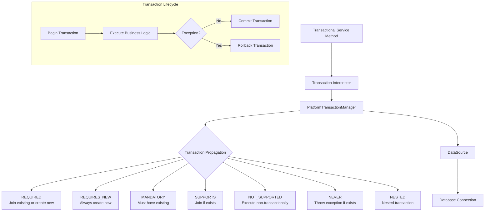

### Declarative Transaction Management

```java
@Service
@Transactional
@Slf4j
public class UserService {

    private final UserRepository userRepository;
    private final EmailService emailService;
    private final AuditService auditService;

    public UserService(UserRepository userRepository,
                      EmailService emailService,
                      AuditService auditService) {
        this.userRepository = userRepository;
        this.emailService = emailService;
        this.auditService = auditService;
    }

    // Default transaction settings (READ_WRITE, REQUIRED)
    @Transactional
    public User createUser(CreateUserRequest request) {
        log.info("Creating user with email: {}", request.getEmail());

        // Check if user already exists
        if (userRepository.existsByEmail(request.getEmail())) {
            throw new UserAlreadyExistsException("User with email " + request.getEmail() + " already exists");
        }

        User user = User.builder()
                .email(request.getEmail())
                .firstName(request.getFirstName())
                .lastName(request.getLastName())
                .password(passwordEncoder.encode(request.getPassword()))
                .role(request.getRole())
                .status(UserStatus.ACTIVE)
                .build();

        User savedUser = userRepository.save(user);

        // Send welcome email (this will use a separate transaction)
        sendWelcomeEmail(savedUser);

        // Audit the user creation
        auditService.logUserCreation(savedUser.getId());

        log.info("User created successfully with ID: {}", savedUser.getId());
        return savedUser;
    }

    // Read-only transaction for better performance
    @Transactional(readOnly = true)
    public Optional<User> getUserById(Long id) {
        return userRepository.findById(id);
    }

    // Read-only with custom timeout
    @Transactional(readOnly = true, timeout = 30)
    public Page<User> getAllUsers(Pageable pageable) {
        return userRepository.findAll(pageable);
    }

    // Custom propagation - always create new transaction
    @Transactional(propagation = Propagation.REQUIRES_NEW)
    public void sendWelcomeEmail(User user) {
        try {
            emailService.sendWelcomeEmail(user.getEmail(), user.getFirstName());
            log.info("Welcome email sent to: {}", user.getEmail());
        } catch (Exception e) {
            log.error("Failed to send welcome email to: {}", user.getEmail(), e);
            // This exception won't rollback the parent transaction
            // because this runs in a separate transaction
        }
    }

    // Custom rollback rules
    @Transactional(rollbackFor = {Exception.class},
                   noRollbackFor = {ValidationException.class})
    public User updateUser(Long id, UpdateUserRequest request) {
        User user = userRepository.findById(id)
                .orElseThrow(() -> new UserNotFoundException("User not found with ID: " + id));

        // Validate request
        validateUpdateRequest(request); // May throw ValidationException (no rollback)

        user.setFirstName(request.getFirstName());
        user.setLastName(request.getLastName());
        user.setRole(request.getRole());

        User updatedUser = userRepository.save(user);

        // May throw other exceptions (will cause rollback)
        auditService.logUserUpdate(user.getId(), request);

        return updatedUser;
    }

    // Nested transaction example
    @Transactional
    public void processUserBatch(List<CreateUserRequest> requests) {
        for (CreateUserRequest request : requests) {
            try {
                createUserWithNestedTransaction(request);
            } catch (Exception e) {
                log.error("Failed to process user: {}", request.getEmail(), e);
                // Continue processing other users
            }
        }
    }

    @Transactional(propagation = Propagation.NESTED)
    public void createUserWithNestedTransaction(CreateUserRequest request) {
        // This will create a nested transaction
        // If this fails, only this nested transaction is rolled back
        User user = createUser(request);

        // Additional processing that might fail
        processUserProfile(user);
    }

    // Programmatic transaction management example
    public void transferFunds(Long fromUserId, Long toUserId, BigDecimal amount) {
        TransactionTemplate transactionTemplate = new TransactionTemplate(transactionManager);
        transactionTemplate.setPropagationBehavior(TransactionDefinition.PROPAGATION_REQUIRED);
        transactionTemplate.setIsolationLevel(TransactionDefinition.ISOLATION_REPEATABLE_READ);

        transactionTemplate.execute(status -> {
            try {
                // Withdraw from source account
                Account fromAccount = accountRepository.findById(fromUserId)
                        .orElseThrow(() -> new AccountNotFoundException("From account not found"));

                if (fromAccount.getBalance().compareTo(amount) < 0) {
                    throw new InsufficientFundsException("Insufficient funds");
                }

                fromAccount.setBalance(fromAccount.getBalance().subtract(amount));
                accountRepository.save(fromAccount);

                // Deposit to destination account
                Account toAccount = accountRepository.findById(toUserId)
                        .orElseThrow(() -> new AccountNotFoundException("To account not found"));

                toAccount.setBalance(toAccount.getBalance().add(amount));
                accountRepository.save(toAccount);

                // Log the transaction
                TransactionLog transactionLog = TransactionLog.builder()
                        .fromAccountId(fromUserId)
                        .toAccountId(toUserId)
                        .amount(amount)
                        .status(TransactionStatus.COMPLETED)
                        .build();

                transactionLogRepository.save(transactionLog);

                return null;
            } catch (Exception e) {
                status.setRollbackOnly();
                throw e;
            }
        });
    }
}
```

### Transaction Configuration

```java
@Configuration
@EnableTransactionManagement
public class TransactionConfig implements TransactionManagementConfigurer {

    @Autowired
    private EntityManagerFactory entityManagerFactory;

    @Bean
    @Override
    public PlatformTransactionManager annotationDrivenTransactionManager() {
        JpaTransactionManager transactionManager = new JpaTransactionManager();
        transactionManager.setEntityManagerFactory(entityManagerFactory);
        transactionManager.setDefaultTimeout(30);
        transactionManager.setRollbackOnCommitFailure(true);
        return transactionManager;
    }

    @Bean
    public TransactionTemplate transactionTemplate(
            PlatformTransactionManager transactionManager) {
        TransactionTemplate template = new TransactionTemplate(transactionManager);
        template.setPropagationBehavior(TransactionDefinition.PROPAGATION_REQUIRED);
        template.setIsolationLevel(TransactionDefinition.ISOLATION_DEFAULT);
        template.setTimeout(30);
        return template;
    }

    // Custom transaction advisor for specific packages
    @Bean
    public TransactionInterceptor transactionInterceptor() {
        TransactionInterceptor interceptor = new TransactionInterceptor();
        interceptor.setTransactionManager(annotationDrivenTransactionManager());

        Properties transactionAttributes = new Properties();
        transactionAttributes.setProperty("get*", "PROPAGATION_SUPPORTS,readOnly");
        transactionAttributes.setProperty("find*", "PROPAGATION_SUPPORTS,readOnly");
        transactionAttributes.setProperty("load*", "PROPAGATION_SUPPORTS,readOnly");
        transactionAttributes.setProperty("*", "PROPAGATION_REQUIRED");

        interceptor.setTransactionAttributes(transactionAttributes);
        return interceptor;
    }
}
```

### Interview Questions - Data Access & Transactions

**Q1: What are the different transaction propagation levels in Spring?**

**Answer:** Spring provides 7 transaction propagation levels:

1. **REQUIRED** (Default): Join existing transaction or create new one
2. **REQUIRES_NEW**: Always create new transaction, suspend existing one
3. **MANDATORY**: Must execute within existing transaction, throw exception if none
4. **SUPPORTS**: Join existing transaction if available, execute non-transactionally otherwise
5. **NOT_SUPPORTED**: Execute non-transactionally, suspend existing transaction
6. **NEVER**: Execute non-transactionally, throw exception if transaction exists
7. **NESTED**: Execute within nested transaction if existing transaction available

**Q2: What is the difference between declarative and programmatic transaction management?**

**Answer:**

**Declarative Transaction Management:**

- Uses annotations (`@Transactional`) or XML configuration
- AOP-based approach
- Less intrusive to business logic
- Easier to maintain and read
- Preferred approach in most cases

**Programmatic Transaction Management:**

- Manual transaction control using `TransactionTemplate` or `PlatformTransactionManager`
- More flexible and fine-grained control
- More verbose and intrusive
- Used when complex transaction logic is needed
- Better for dynamic transaction attributes

**Q3: How do you handle transaction rollback in Spring?**

**Answer:** Spring provides several ways to handle transaction rollback:

1. **Automatic Rollback**: By default, runtime exceptions cause rollback
2. **Custom Rollback Rules**:

```java
@Transactional(rollbackFor = {Exception.class},
               noRollbackFor = {ValidationException.class})
```

3. **Manual Rollback**:

```java
TransactionAspectSupport.currentTransactionStatus().setRollbackOnly();
```

4. **Rollback in Programmatic Transactions**:

```java
transactionTemplate.execute(status -> {
    try {
        // business logic
    } catch (Exception e) {
        status.setRollbackOnly();
        throw e;
    }
});
```

---

## 🚀 Spring Boot

### Introduction to Spring Boot

Spring Boot makes it easy to create stand-alone, production-grade Spring-based applications with minimal configuration.

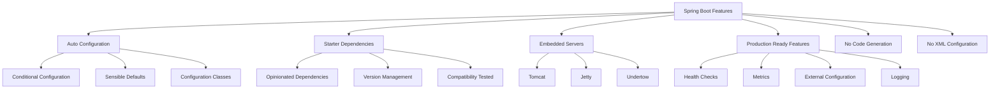

### Spring Boot Application Structure

```
src/
├── main/
│   ├── java/
│   │   └── com/example/myapp/
│   │       ├── MyAppApplication.java
│   │       ├── config/
│   │       │   ├── DatabaseConfig.java
│   │       │   ├── SecurityConfig.java
│   │       │   └── WebConfig.java
│   │       ├── controller/
│   │       │   ├── UserController.java
│   │       │   └── OrderController.java
│   │       ├── service/
│   │       │   ├── UserService.java
│   │       │   └── OrderService.java
│   │       ├── repository/
│   │       │   ├── UserRepository.java
│   │       │   └── OrderRepository.java
│   │       ├── entity/
│   │       │   ├── User.java
│   │       │   └── Order.java
│   │       ├── dto/
│   │       │   ├── UserDTO.java
│   │       │   └── OrderDTO.java
│   │       └── exception/
│   │           ├── GlobalExceptionHandler.java
│   │           └── CustomExceptions.java
│   └── resources/
│       ├── application.yml
│       ├── application-dev.yml
│       ├── application-prod.yml
│       ├── static/
│       ├── templates/
│       └── db/migration/
└── test/
    ├── java/
    └── resources/
```

### Main Application Class

```java
@SpringBootApplication
@EnableJpaAuditing
@EnableScheduling
@EnableAsync
public class MyAppApplication {

    public static void main(String[] args) {
        SpringApplication application = new SpringApplication(MyAppApplication.class);

        // Customize application startup
        application.setBannerMode(Banner.Mode.CONSOLE);
        application.setLogStartupInfo(true);
        application.setRegisterShutdownHook(true);

        // Add listeners
        application.addListeners(new ApplicationStartupListener());

        // Set default properties
        Properties defaultProperties = new Properties();
        defaultProperties.setProperty("spring.profiles.active", "development");
        application.setDefaultProperties(defaultProperties);

        ConfigurableApplicationContext context = application.run(args);

        // Log application startup information
        Environment env = context.getEnvironment();
        String protocol = "http";
        if (env.getProperty("server.ssl.key-store") != null) {
            protocol = "https";
        }

        String serverPort = env.getProperty("server.port");
        String contextPath = env.getProperty("server.servlet.context-path");
        if (contextPath == null) {
            contextPath = "/";
        }

        log.info("\n----------------------------------------------------------\n\t" +
                "Application '{}' is running! Access URLs:\n\t" +
                "Local: \t\t{}://localhost:{}{}\n\t" +
                "Profile(s): \t{}\n" +
                "----------------------------------------------------------",
                env.getProperty("spring.application.name"),
                protocol,
                serverPort,
                contextPath,
                env.getActiveProfiles());
    }

    // Bean definitions
    @Bean
    public PasswordEncoder passwordEncoder() {
        return new BCryptPasswordEncoder();
    }

    @Bean
    public RestTemplate restTemplate() {
        RestTemplate restTemplate = new RestTemplate();

        // Add interceptors
        restTemplate.getInterceptors().add(new LoggingInterceptor());

        // Configure timeout
        HttpComponentsClientHttpRequestFactory factory =
            new HttpComponentsClientHttpRequestFactory();
        factory.setConnectTimeout(5000);
        factory.setReadTimeout(10000);
        restTemplate.setRequestFactory(factory);

        return restTemplate;
    }

    @Bean
    public TaskExecutor taskExecutor() {
        ThreadPoolTaskExecutor executor = new ThreadPoolTaskExecutor();
        executor.setCorePoolSize(5);
        executor.setMaxPoolSize(10);
        executor.setQueueCapacity(100);
        executor.setThreadNamePrefix("MyApp-Async-");
        executor.setRejectedExecutionHandler(new ThreadPoolExecutor.CallerRunsPolicy());
        executor.initialize();
        return executor;
    }

    @Bean
    @ConditionalOnProperty(name = "app.scheduling.enabled", havingValue = "true", matchIfMissing = true)
    public TaskScheduler taskScheduler() {
        ThreadPoolTaskScheduler scheduler = new ThreadPoolTaskScheduler();
        scheduler.setPoolSize(5);
        scheduler.setThreadNamePrefix("MyApp-Scheduled-");
        scheduler.initialize();
        return scheduler;
    }
}

// Custom application listener
@Component
@Slf4j
public class ApplicationStartupListener implements ApplicationListener<ApplicationReadyEvent> {

    @Override
    public void onApplicationEvent(ApplicationReadyEvent event) {
        log.info("Application startup completed. Performing post-startup tasks...");

        // Perform any initialization tasks
        initializeCache();
        warmupDatabase();
        schedulePeriodicTasks();
    }

    private void initializeCache() {
        log.info("Initializing application cache...");
        // Cache initialization logic
    }

    private void warmupDatabase() {
        log.info("Warming up database connections...");
        // Database warmup logic
    }

    private void schedulePeriodicTasks() {
        log.info("Scheduling periodic tasks...");
        // Task scheduling logic
    }
}
```

### Configuration Properties

```yaml
# application.yml
spring:
    application:
        name: myapp

    profiles:
        active: development

    datasource:
        url: jdbc:mysql://localhost:3306/myapp
        username: ${DB_USERNAME:myapp}
        password: ${DB_PASSWORD:password}
        driver-class-name: com.mysql.cj.jdbc.Driver
        hikari:
            maximum-pool-size: 20
            minimum-idle: 5
            idle-timeout: 300000
            connection-timeout: 20000
            max-lifetime: 1200000
            pool-name: MyAppHikariCP

    jpa:
        hibernate:
            ddl-auto: validate
        show-sql: false
        properties:
            hibernate:
                dialect: org.hibernate.dialect.MySQL8Dialect
                format_sql: true
                use_sql_comments: true
                jdbc:
                    batch_size: 20
                order_inserts: true
                order_updates: true

    liquibase:
        change-log: classpath:db/changelog/db.changelog-master.xml

    redis:
        host: localhost
        port: 6379
        password: ${REDIS_PASSWORD:}
        timeout: 2000ms
        lettuce:
            pool:
                max-active: 8
                max-idle: 8
                min-idle: 0

    cache:
        type: redis
        redis:
            time-to-live: 600000

    security:
        oauth2:
            client:
                registration:
                    google:
                        client-id: ${GOOGLE_CLIENT_ID}
                        client-secret: ${GOOGLE_CLIENT_SECRET}
                        redirect-uri: '{baseUrl}/login/oauth2/code/{registrationId}'
                        scope:
                            - openid
                            - profile
                            - email

    mail:
        host: smtp.gmail.com
        port: 587
        username: ${EMAIL_USERNAME}
        password: ${EMAIL_PASSWORD}
        properties:
            mail:
                smtp:
                    auth: true
                    starttls:
                        enable: true
                        required: true
                    ssl:
                        trust: smtp.gmail.com

    servlet:
        multipart:
            max-file-size: 10MB
            max-request-size: 10MB

    jackson:
        serialization:
            write-dates-as-timestamps: false
            indent-output: true
        deserialization:
            fail-on-unknown-properties: false
        default-property-inclusion: NON_NULL

server:
    port: 8080
    servlet:
        context-path: /api
    compression:
        enabled: true
        mime-types: text/html,text/xml,text/plain,text/css,text/javascript,application/javascript,application/json
        min-response-size: 1024
    http2:
        enabled: true

logging:
    level:
        com.example.myapp: DEBUG
        org.springframework.security: DEBUG
        org.hibernate.SQL: DEBUG
        org.hibernate.type.descriptor.sql.BasicBinder: TRACE
    pattern:
        console: '%d{yyyy-MM-dd HH:mm:ss} - %msg%n'
        file: '%d{yyyy-MM-dd HH:mm:ss} [%thread] %-5level %logger{36} - %msg%n'
    file:
        name: logs/myapp.log
        max-size: 10MB
        max-history: 30

management:
    endpoints:
        web:
            exposure:
                include: '*'
            base-path: /actuator
    endpoint:
        health:
            show-details: when-authorized
            show-components: always
        metrics:
            enabled: true
    health:
        mail:
            enabled: false
    metrics:
        export:
            prometheus:
                enabled: true

# Custom application properties
app:
    name: MyApp
    version: 1.0.0
    description: My Spring Boot Application

    cors:
        allowed-origins: 'http://localhost:3000,http://localhost:4200'
        allowed-methods: 'GET,POST,PUT,DELETE,PATCH'
        allowed-headers: '*'
        allow-credentials: true
        max-age: 3600

    jwt:
        secret: ${JWT_SECRET:mySecretKey}
        expiration: 86400000 # 24 hours
        refresh-expiration: 604800000 # 7 days

    file-upload:
        directory: ${FILE_UPLOAD_DIR:./uploads}
        max-size: 10MB
        allowed-types: jpg,jpeg,png,pdf,doc,docx

    email:
        from: noreply@myapp.com
        templates:
            welcome: classpath:email-templates/welcome.html
            password-reset: classpath:email-templates/password-reset.html

    scheduling:
        enabled: true
        pool-size: 5

    async:
        enabled: true
        core-pool-size: 5
        max-pool-size: 10
        queue-capacity: 100

---
# Development Profile
spring:
    config:
        activate:
            on-profile: development

    datasource:
        url: jdbc:h2:mem:testdb
        driver-class-name: org.h2.Driver
        username: sa
        password:

    h2:
        console:
            enabled: true
            path: /h2-console

    jpa:
        hibernate:
            ddl-auto: create-drop
        show-sql: true

    liquibase:
        enabled: false

logging:
    level:
        root: INFO
        com.example.myapp: DEBUG

---
# Production Profile
spring:
    config:
        activate:
            on-profile: production

    jpa:
        hibernate:
            ddl-auto: validate
        show-sql: false

    liquibase:
        enabled: true

logging:
    level:
        root: WARN
        com.example.myapp: INFO

server:
    ssl:
        enabled: true
        key-store: classpath:keystore.p12
        key-store-password: ${KEYSTORE_PASSWORD}
        key-store-type: PKCS12
        key-alias: myapp

management:
    endpoints:
        web:
            exposure:
                include: health,info,metrics,prometheus
```

### Custom Configuration Properties

```java
@ConfigurationProperties(prefix = "app")
@Data
@Component
@Validated
public class AppProperties {

    @NotBlank
    private String name;

    @NotBlank
    private String version;

    private String description;

    @Valid
    private Cors cors = new Cors();

    @Valid
    private Jwt jwt = new Jwt();

    @Valid
    private FileUpload fileUpload = new FileUpload();

    @Valid
    private Email email = new Email();

    @Valid
    private Scheduling scheduling = new Scheduling();

    @Valid
    private Async async = new Async();

    @Data
    public static class Cors {
        private String allowedOrigins = "*";
        private String allowedMethods = "*";
        private String allowedHeaders = "*";
        private boolean allowCredentials = false;

        @Min(0)
        private long maxAge = 1800;
    }

    @Data
    public static class Jwt {
        @NotBlank
        private String secret;

        @Min(1000)
        private long expiration = 86400000; // 24 hours

        @Min(1000)
        private long refreshExpiration = 604800000; // 7 days
    }

    @Data
    public static class FileUpload {
        @NotBlank
        private String directory = "./uploads";

        private String maxSize = "10MB";

        private List<String> allowedTypes = Arrays.asList("jpg", "jpeg", "png", "pdf");
    }

    @Data
    public static class Email {
        @Email
        @NotBlank
        private String from;

        @Valid
        private Templates templates = new Templates();

        @Data
        public static class Templates {
            private String welcome;
            private String passwordReset;
        }
    }

    @Data
    public static class Scheduling {
        private boolean enabled = true;

        @Min(1)
        private int poolSize = 5;
    }

    @Data
    public static class Async {
        private boolean enabled = true;

        @Min(1)
        private int corePoolSize = 5;

        @Min(1)
        private int maxPoolSize = 10;

        @Min(0)
        private int queueCapacity = 100;
    }
}

// Usage in service
@Service
public class ConfigurationService {

    private final AppProperties appProperties;

    public ConfigurationService(AppProperties appProperties) {
        this.appProperties = appProperties;
    }

    public void printConfiguration() {
        System.out.println("App Name: " + appProperties.getName());
        System.out.println("App Version: " + appProperties.getVersion());
        System.out.println("JWT Secret: " + appProperties.getJwt().getSecret());
        System.out.println("CORS Allowed Origins: " + appProperties.getCors().getAllowedOrigins());
    }
}
```

### Interview Questions - Spring Boot

**Q1: What is Spring Boot and how does it differ from Spring Framework?**

**Answer:** Spring Boot is an extension of Spring Framework that simplifies the setup and development of Spring applications. Key differences:

**Spring Boot:**

- Auto-configuration based on classpath
- Embedded servers (Tomcat, Jetty, Undertow)
- Starter dependencies for common use cases
- Production-ready features out of the box
- Minimal configuration required
- Opinionated defaults

**Spring Framework:**

- Requires extensive manual configuration
- External server deployment
- Manual dependency management
- Basic features only
- More configuration flexibility
- No opinionated approach

**Q2: What is Spring Boot Auto-Configuration and how does it work?**

**Answer:** Auto-configuration automatically configures beans based on:

1. **Classpath Dependencies**: What JARs are on the classpath
2. **Properties**: Configuration properties set
3. **Existing Beans**: Beans already defined in the context
4. **Conditional Annotations**: `@ConditionalOnClass`, `@ConditionalOnBean`, etc.

**How it works:**

- `@EnableAutoConfiguration` enables auto-configuration
- Spring Boot scans `META-INF/spring.factories` files
- Loads auto-configuration classes listed in the files
- Each auto-configuration class has conditional logic
- Beans are created only when conditions are met

**Q3: What are Spring Boot Starters and why are they useful?**

**Answer:** Starters are dependency descriptors that bring together related dependencies for specific functionality:

**Benefits:**

- **Simplified Dependencies**: Single dependency brings multiple related JARs
- **Version Management**: Compatible versions are pre-selected
- **Reduced Configuration**: Auto-configuration works with starters
- **Best Practices**: Follows Spring Boot conventions

**Common Starters:**

- `spring-boot-starter-web`: Web applications
- `spring-boot-starter-data-jpa`: JPA data access
- `spring-boot-starter-security`: Security features
- `spring-boot-starter-test`: Testing frameworks
- `spring-boot-starter-actuator`: Production monitoring

---

## ⚙️ Spring Boot Auto-Configuration

### How Auto-Configuration Works

```mermaid
flowchart TB
    A[Spring Boot Application Starts] --> B[Load @SpringBootApplication]
    B --> C[@EnableAutoConfiguration]
    C --> D[Scan META-INF/spring.factories]
    D --> E[Load Auto-Configuration Classes]
    E --> F{Evaluate Conditions}
    F -->|Conditions Met| G[Create Beans]
    F -->|Conditions Not Met| H[Skip Configuration]
    G --> I[Application Context Ready]
    H --> I

    subgraph "Conditional Annotations"
        J[@ConditionalOnClass]
        K[@ConditionalOnBean]
        L[@ConditionalOnProperty]
        M[@ConditionalOnMissingBean]
    end

    F --> J
    F --> K
    F --> L
    F --> M
```

### Creating Custom Auto-Configuration

```java
// Custom Auto-Configuration Class
@Configuration
@ConditionalOnClass(MyCustomService.class)
@ConditionalOnProperty(
    prefix = "myapp.custom",
    name = "enabled",
    havingValue = "true",
    matchIfMissing = true
)
@EnableConfigurationProperties(MyCustomProperties.class)
public class MyCustomAutoConfiguration {

    @Autowired
    private MyCustomProperties properties;

    @Bean
    @ConditionalOnMissingBean
    public MyCustomService myCustomService() {
        return new MyCustomServiceImpl(properties);
    }

    @Bean
    @ConditionalOnBean(DataSource.class)
    @ConditionalOnMissingBean
    public MyCustomRepository myCustomRepository(DataSource dataSource) {
        return new MyCustomRepositoryImpl(dataSource);
    }

    @Configuration
    @ConditionalOnWebApplication(type = ConditionalOnWebApplication.Type.SERVLET)
    protected static class WebConfiguration {

        @Bean
        @ConditionalOnMissingBean
        public MyCustomController myCustomController(MyCustomService service) {
            return new MyCustomController(service);
        }
    }

    @Configuration
    @ConditionalOnClass(RedisTemplate.class)
    protected static class RedisConfiguration {

        @Bean
        @ConditionalOnMissingBean
        public MyCustomCacheManager cacheManager(RedisTemplate<String, Object> redisTemplate) {
            return new MyCustomCacheManager(redisTemplate);
        }
    }
}

// Configuration Properties
@ConfigurationProperties(prefix = "myapp.custom")
@Data
@Validated
public class MyCustomProperties {

    private boolean enabled = true;

    @NotBlank
    private String apiUrl = "https://api.example.com";

    @Min(1000)
    @Max(60000)
    private int timeout = 5000;

    @Valid
    private Cache cache = new Cache();

    @Data
    public static class Cache {
        private boolean enabled = true;
        private int ttl = 300; // seconds
        private int maxSize = 1000;
    }
}

// Register Auto-Configuration
// META-INF/spring.factories
# org.springframework.boot.autoconfigure.EnableAutoConfiguration=\
# com.example.autoconfigure.MyCustomAutoConfiguration

// Starter POM
<!-- my-custom-spring-boot-starter/pom.xml -->
<dependencies>
    <dependency>
        <groupId>org.springframework.boot</groupId>
        <artifactId>spring-boot-starter</artifactId>
    </dependency>
    <dependency>
        <groupId>com.example</groupId>
        <artifactId>my-custom-autoconfigure</artifactId>
    </dependency>
    <dependency>
        <groupId>com.example</groupId>
        <artifactId>my-custom-core</artifactId>
    </dependency>
</dependencies>
```

---

## 📊 Spring Boot Actuator

### Actuator Overview

```mermaid
graph TB
    A[Spring Boot Actuator] --> B[Health Checks]
    A --> C[Metrics]
    A --> D[Application Info]
    A --> E[Environment Details]
    A --> F[HTTP Trace]
    A --> G[Thread Dump]
    A --> H[Heap Dump]

    B --> B1[Database Health]
    B --> B2[Redis Health]
    B --> B3[Custom Health Indicators]

    C --> C1[JVM Metrics]
    C --> C2[HTTP Metrics]
    C --> C3[Custom Metrics]

    subgraph "Management Endpoints"
        I[/actuator/health]
        J[/actuator/metrics]
        K[/actuator/info]
        L[/actuator/env]
        M[/actuator/beans]
        N[/actuator/mappings]
    end
```

### Actuator Configuration

```yaml
# application.yml
management:
  endpoints:
    web:
      exposure:
        include: "*"  # Expose all endpoints
        exclude: "shutdown,threaddump"  # Exclude specific endpoints
      base-path: /actuator
      cors:
        allowed-origins: "http://localhost:3000"
        allowed-methods: "GET,POST"
    jmx:
      exposure:
        include: "*"

  endpoint:
    health:
      show-details: when-authorized
      show-components: always
      probes:
        enabled: true
    info:
      enabled: true
    metrics:
      enabled: true
    prometheus:
      enabled: true
    shutdown:
      enabled: false  # Dangerous in production

  health:
    livenessstate:
      enabled: true
    readinessstate:
      enabled: true
    db:
      enabled: true
    redis:
      enabled: true
    mail:
      enabled: false
    diskspace:
      enabled: true
      threshold: 10MB

  metrics:
    tags:
      application: ${spring.application.name}
      environment: ${spring.profiles.active}
    export:
      prometheus:
        enabled: true
        step: 60s
      influx:
        enabled: false
    web:
      server:
        request:
          autotime:
            enabled: true
            percentiles: 0.5,0.95,0.99
    distribution:
      percentiles-histogram:
        http.server.requests: true
      slo:
        http.server.requests: 10ms,50ms,100ms,200ms,500ms

# Custom info endpoint
info:
  app:
    name: ${spring.application.name}
    version: @project.version@
    description: My Spring Boot Application
    java-version: ${java.version}
  build:
    artifact: @project.artifactId@
    group: @project.groupId@
    version: @project.version@
    time: @maven.build.timestamp@
  git:
    branch: ${git.branch:unknown}
    commit:
      id: ${git.commit.id:unknown}
      time: ${git.commit.time:unknown}
```

### Custom Health Indicators

```java
@Component
public class DatabaseHealthIndicator implements HealthIndicator {

    private final DataSource dataSource;

    public DatabaseHealthIndicator(DataSource dataSource) {
        this.dataSource = dataSource;
    }

    @Override
    public Health health() {
        try (Connection connection = dataSource.getConnection()) {
            if (connection.isValid(1)) {
                return Health.up()
                    .withDetail("database", "Available")
                    .withDetail("validationQuery", "SELECT 1")
                    .build();
            } else {
                return Health.down()
                    .withDetail("database", "Connection validation failed")
                    .build();
            }
        } catch (Exception e) {
            return Health.down()
                    .withDetail("database", "Connection failed")
                    .withException(e)
                    .build();
        }
    }
}

@Component
public class ExternalServiceHealthIndicator implements HealthIndicator {

    private final RestTemplate restTemplate;
    private final String healthCheckUrl;

    public ExternalServiceHealthIndicator(RestTemplate restTemplate,
                                         @Value("${external.service.health-url}") String healthCheckUrl) {
        this.restTemplate = restTemplate;
        this.healthCheckUrl = healthCheckUrl;
    }

    @Override
    public Health health() {
        try {
            ResponseEntity<String> response = restTemplate.getForEntity(healthCheckUrl, String.class);

            if (response.getStatusCode().is2xxSuccessful()) {
                return Health.up()
                    .withDetail("externalService", "Available")
                    .withDetail("responseTime", measureResponseTime())
                    .withDetail("statusCode", response.getStatusCodeValue())
                    .build();
            } else {
                return Health.down()
                    .withDetail("externalService", "Unhealthy")
                    .withDetail("statusCode", response.getStatusCodeValue())
                    .build();
            }
        } catch (Exception e) {
            return Health.down()
                    .withDetail("externalService", "Unavailable")
                    .withException(e)
                    .build();
        }
    }

    private long measureResponseTime() {
        long start = System.currentTimeMillis();
        try {
            restTemplate.getForEntity(healthCheckUrl, String.class);
        } catch (Exception ignored) {
            // We're just measuring time here
        }
        return System.currentTimeMillis() - start;
    }
}

// Custom Health Indicator Group
@Component
public class CustomHealthIndicatorGroup {

    @Bean
    public CompositeHealthContributor databaseHealthIndicators() {
        Map<String, HealthContributor> indicators = new LinkedHashMap<>();
        indicators.put("primary", new DatabaseHealthIndicator(primaryDataSource));
        indicators.put("secondary", new DatabaseHealthIndicator(secondaryDataSource));
        return CompositeHealthContributor.fromMap(indicators);
    }
}
```

### Custom Metrics

```java
@Service
@Slf4j
public class CustomMetricsService {

    private final Counter userRegistrationCounter;
    private final Timer userRegistrationTimer;
    private final Gauge activeUsersGauge;
    private final DistributionSummary orderAmountSummary;

    public CustomMetricsService(MeterRegistry meterRegistry) {
        this.userRegistrationCounter = Counter.builder("user.registration")
                .description("Number of user registrations")
                .tag("type", "total")
                .register(meterRegistry);

        this.userRegistrationTimer = Timer.builder("user.registration.time")
                .description("Time taken for user registration")
                .register(meterRegistry);

        this.activeUsersGauge = Gauge.builder("user.active")
                .description("Number of currently active users")
                .register(meterRegistry, this, CustomMetricsService::getActiveUserCount);

        this.orderAmountSummary = DistributionSummary.builder("order.amount")
                .description("Order amounts")
                .baseUnit("dollars")
                .register(meterRegistry);
    }

    public void recordUserRegistration() {
        userRegistrationCounter.increment();
    }

    public void recordUserRegistrationTime(Duration duration) {
        userRegistrationTimer.record(duration);
    }

    public Timer.Sample startRegistrationTimer() {
        return Timer.start();
    }

    public void stopRegistrationTimer(Timer.Sample sample) {
        sample.stop(userRegistrationTimer);
    }

    public void recordOrderAmount(double amount) {
        orderAmountSummary.record(amount);
    }

    private double getActiveUserCount() {
        // Implementation to get active user count
        return activeUserService.getActiveUserCount();
    }
}

// Usage in service
@Service
public class UserService {

    private final CustomMetricsService metricsService;
    private final UserRepository userRepository;

    public UserService(CustomMetricsService metricsService, UserRepository userRepository) {
        this.metricsService = metricsService;
        this.userRepository = userRepository;
    }

    public User registerUser(UserRegistrationRequest request) {
        Timer.Sample sample = metricsService.startRegistrationTimer();

        try {
            User user = createUser(request);
            userRepository.save(user);

            metricsService.recordUserRegistration();
            sample.stop(metricsService.getUserRegistrationTimer());

            return user;
        } catch (Exception e) {
            sample.stop(metricsService.getUserRegistrationTimer());
            throw e;
        }
    }
}
```

---

## 🔐 Spring Security

### Security Configuration

```java
@Configuration
@EnableWebSecurity
@EnableGlobalMethodSecurity(prePostEnabled = true, securedEnabled = true)
public class SecurityConfig {

    private final UserDetailsService userDetailsService;
    private final JwtAuthenticationEntryPoint jwtAuthenticationEntryPoint;
    private final JwtAuthenticationFilter jwtAuthenticationFilter;

    public SecurityConfig(UserDetailsService userDetailsService,
                         JwtAuthenticationEntryPoint jwtAuthenticationEntryPoint,
                         JwtAuthenticationFilter jwtAuthenticationFilter) {
        this.userDetailsService = userDetailsService;
        this.jwtAuthenticationEntryPoint = jwtAuthenticationEntryPoint;
        this.jwtAuthenticationFilter = jwtAuthenticationFilter;
    }

    @Bean
    public SecurityFilterChain filterChain(HttpSecurity http) throws Exception {
        http
            .csrf(csrf -> csrf.disable())
            .sessionManagement(session ->
                session.sessionCreationPolicy(SessionCreationPolicy.STATELESS))

            .authorizeHttpRequests(authz -> authz
                // Public endpoints
                .requestMatchers("/api/auth/**").permitAll()
                .requestMatchers("/api/public/**").permitAll()
                .requestMatchers("/actuator/health/**").permitAll()
                .requestMatchers(HttpMethod.GET, "/api/products/**").permitAll()

                // Admin endpoints
                .requestMatchers("/api/admin/**").hasRole("ADMIN")
                .requestMatchers(HttpMethod.DELETE, "/api/**").hasRole("ADMIN")

                // User endpoints
                .requestMatchers("/api/users/**").hasAnyRole("USER", "ADMIN")
                .requestMatchers(HttpMethod.POST, "/api/orders/**").hasRole("USER")

                // All other requests need authentication
                .anyRequest().authenticated()
            )

            .exceptionHandling(ex -> ex
                .authenticationEntryPoint(jwtAuthenticationEntryPoint)
                .accessDeniedHandler(new CustomAccessDeniedHandler())
            )

            .addFilterBefore(jwtAuthenticationFilter, UsernamePasswordAuthenticationFilter.class)

            .headers(headers -> headers
                .frameOptions().deny()
                .contentTypeOptions().and()
                .xssProtection().and()
                .referrerPolicy(ReferrerPolicy.STRICT_ORIGIN_WHEN_CROSS_ORIGIN)
                .httpStrictTransportSecurity(hstsConfig -> hstsConfig
                    .maxAgeInSeconds(31536000)
                    .includeSubdomains(true)
                )
            );

        return http.build();
    }

    @Bean
    public AuthenticationManager authenticationManager(
            AuthenticationConfiguration authConfig) throws Exception {
        return authConfig.getAuthenticationManager();
    }

    @Bean
    public DaoAuthenticationProvider authenticationProvider() {
        DaoAuthenticationProvider authProvider = new DaoAuthenticationProvider();
        authProvider.setUserDetailsService(userDetailsService);
        authProvider.setPasswordEncoder(passwordEncoder());
        return authProvider;
    }

    @Bean
    public PasswordEncoder passwordEncoder() {
        return new BCryptPasswordEncoder();
    }

    @Bean
    @ConditionalOnProperty(name = "app.cors.enabled", havingValue = "true")
    public CorsConfigurationSource corsConfigurationSource() {
        CorsConfiguration configuration = new CorsConfiguration();
        configuration.setAllowedOriginPatterns(Arrays.asList("*"));
        configuration.setAllowedMethods(Arrays.asList("GET", "POST", "PUT", "PATCH", "DELETE", "OPTIONS"));
        configuration.setAllowedHeaders(Arrays.asList("*"));
        configuration.setAllowCredentials(true);
        configuration.setMaxAge(3600L);

        UrlBasedCorsConfigurationSource source = new UrlBasedCorsConfigurationSource();
        source.registerCorsConfiguration("/api/**", configuration);
        return source;
    }
}
```

### JWT Implementation

```java
@Component
public class JwtTokenProvider {

    @Value("${app.jwt.secret}")
    private String jwtSecret;

    @Value("${app.jwt.expiration}")
    private int jwtExpirationMs;

    private static final Logger logger = LoggerFactory.getLogger(JwtTokenProvider.class);

    public String generateJwtToken(Authentication authentication) {
        UserPrincipal userPrincipal = (UserPrincipal) authentication.getPrincipal();
        Date expiryDate = new Date(System.currentTimeMillis() + jwtExpirationMs);

        return Jwts.builder()
                .setSubject(Long.toString(userPrincipal.getId()))
                .setIssuedAt(new Date())
                .setExpiration(expiryDate)
                .claim("roles", userPrincipal.getAuthorities().stream()
                    .map(GrantedAuthority::getAuthority)
                    .collect(Collectors.toList()))
                .signWith(SignatureAlgorithm.HS512, jwtSecret)
                .compact();
    }

    public Long getUserIdFromJWT(String token) {
        Claims claims = Jwts.parser()
                .setSigningKey(jwtSecret)
                .parseClaimsJws(token)
                .getBody();

        return Long.parseLong(claims.getSubject());
    }

    public boolean validateToken(String authToken) {
        try {
            Jwts.parser().setSigningKey(jwtSecret).parseClaimsJws(authToken);
            return true;
        } catch (SignatureException ex) {
            logger.error("Invalid JWT signature");
        } catch (MalformedJwtException ex) {
            logger.error("Invalid JWT token");
        } catch (ExpiredJwtException ex) {
            logger.error("Expired JWT token");
        } catch (UnsupportedJwtException ex) {
            logger.error("Unsupported JWT token");
        } catch (IllegalArgumentException ex) {
            logger.error("JWT claims string is empty.");
        }
        return false;
    }
}

@Component
public class JwtAuthenticationFilter extends OncePerRequestFilter {

    @Autowired
    private JwtTokenProvider tokenProvider;

    @Autowired
    private CustomUserDetailsService customUserDetailsService;

    @Override
    protected void doFilterInternal(HttpServletRequest request,
                                  HttpServletResponse response,
                                  FilterChain filterChain) throws ServletException, IOException {
        try {
            String jwt = getJwtFromRequest(request);

            if (StringUtils.hasText(jwt) && tokenProvider.validateToken(jwt)) {
                Long userId = tokenProvider.getUserIdFromJWT(jwt);

                UserDetails userDetails = customUserDetailsService.loadUserById(userId);
                UsernamePasswordAuthenticationToken authentication =
                    new UsernamePasswordAuthenticationToken(userDetails, null, userDetails.getAuthorities());
                authentication.setDetails(new WebAuthenticationDetailsSource().buildDetails(request));

                SecurityContextHolder.getContext().setAuthentication(authentication);
            }
        } catch (Exception ex) {
            logger.error("Could not set user authentication in security context", ex);
        }

        filterChain.doFilter(request, response);
    }

    private String getJwtFromRequest(HttpServletRequest request) {
        String bearerToken = request.getHeader("Authorization");
        if (StringUtils.hasText(bearerToken) && bearerToken.startsWith("Bearer ")) {
            return bearerToken.substring(7);
        }
        return null;
    }
}
```

### Method-Level Security

```java
@Service
@Transactional
public class UserService {

    // Only users with ADMIN role can access this method
    @PreAuthorize("hasRole('ADMIN')")
    public List<User> getAllUsers() {
        return userRepository.findAll();
    }

    // Only the user himself or ADMIN can access
    @PreAuthorize("hasRole('ADMIN') or #userId == authentication.principal.id")
    public User getUserById(Long userId) {
        return userRepository.findById(userId)
                .orElseThrow(() -> new UserNotFoundException("User not found"));
    }

    // Post-authorization check
    @PostAuthorize("returnObject.email == authentication.name or hasRole('ADMIN')")
    public User getUserProfile(Long userId) {
        return userRepository.findById(userId)
                .orElseThrow(() -> new UserNotFoundException("User not found"));
    }

    // Method-level filtering
    @PostFilter("hasRole('ADMIN') or filterObject.ownerId == authentication.principal.id")
    public List<Order> getUserOrders(Long userId) {
        return orderRepository.findByUserId(userId);
    }

    // Custom SpEL expression
    @PreAuthorize("@securityService.canAccessUser(authentication, #userId)")
    public void updateUser(Long userId, UpdateUserRequest request) {
        User user = getUserById(userId);
        // Update logic
        userRepository.save(user);
    }
}

@Component("securityService")
public class SecurityService {

    public boolean canAccessUser(Authentication authentication, Long userId) {
        if (hasRole(authentication, "ADMIN")) {
            return true;
        }

        UserPrincipal principal = (UserPrincipal) authentication.getPrincipal();
        return principal.getId().equals(userId);
    }

    private boolean hasRole(Authentication authentication, String role) {
        return authentication.getAuthorities().stream()
                .anyMatch(authority -> authority.getAuthority().equals("ROLE_" + role));
    }
}
```

---

## 🧪 Testing

### Testing Architecture

```mermaid
graph TB
    A[Testing Strategy] --> B[Unit Tests]
    A --> C[Integration Tests]
    A --> D[End-to-End Tests]

    B --> B1[@ExtendWith(MockitoExtension.class)]
    B --> B2[@Mock, @InjectMocks]
    B --> B3[Service Layer Testing]

    C --> C1[@SpringBootTest]
    C --> C2[@TestContainers]
    C --> C3[@AutoConfigureTestDatabase]

    D --> D1[@SpringBootTest(webEnvironment = RANDOM_PORT)]
    D --> D2[TestRestTemplate]
    D --> D3[Full Application Context]

    subgraph "Spring Boot Test Annotations"
        E[@WebMvcTest]
        F[@DataJpaTest]
        G[@JsonTest]
        H[@TestConfiguration]
    end
```

### Unit Testing

```java
// Service Unit Test
@ExtendWith(MockitoExtension.class)
class UserServiceTest {

    @Mock
    private UserRepository userRepository;

    @Mock
    private EmailService emailService;

    @Mock
    private PasswordEncoder passwordEncoder;

    @InjectMocks
    private UserService userService;

    @Test
    @DisplayName("Should create user successfully")
    void shouldCreateUserSuccessfully() {
        // Given
        CreateUserRequest request = CreateUserRequest.builder()
                .email("john.doe@example.com")
                .firstName("John")
                .lastName("Doe")
                .password("password123")
                .role(UserRole.USER)
                .build();

        User savedUser = User.builder()
                .id(1L)
                .email(request.getEmail())
                .firstName(request.getFirstName())
                .lastName(request.getLastName())
                .password("encoded-password")
                .role(request.getRole())
                .status(UserStatus.ACTIVE)
                .build();

        when(userRepository.existsByEmail(request.getEmail())).thenReturn(false);
        when(passwordEncoder.encode(request.getPassword())).thenReturn("encoded-password");
        when(userRepository.save(any(User.class))).thenReturn(savedUser);

        // When
        User result = userService.createUser(request);

        // Then
        assertThat(result).isNotNull();
        assertThat(result.getId()).isEqualTo(1L);
        assertThat(result.getEmail()).isEqualTo(request.getEmail());
        assertThat(result.getStatus()).isEqualTo(UserStatus.ACTIVE);

        verify(userRepository).existsByEmail(request.getEmail());
        verify(passwordEncoder).encode(request.getPassword());
        verify(userRepository).save(any(User.class));
        verify(emailService).sendWelcomeEmail(savedUser.getEmail(), savedUser.getFirstName());
    }

    @Test
    @DisplayName("Should throw exception when user already exists")
    void shouldThrowExceptionWhenUserAlreadyExists() {
        // Given
        CreateUserRequest request = CreateUserRequest.builder()
                .email("existing@example.com")
                .firstName("John")
                .lastName("Doe")
                .password("password123")
                .role(UserRole.USER)
                .build();

        when(userRepository.existsByEmail(request.getEmail())).thenReturn(true);

        // When & Then
        assertThatThrownBy(() -> userService.createUser(request))
                .isInstanceOf(UserAlreadyExistsException.class)
                .hasMessage("User with email existing@example.com already exists");

        verify(userRepository).existsByEmail(request.getEmail());
        verify(userRepository, never()).save(any(User.class));
        verify(emailService, never()).sendWelcomeEmail(anyString(), anyString());
    }

    @ParameterizedTest
    @DisplayName("Should validate user status transitions")
    @CsvSource({
        "ACTIVE, INACTIVE, true",
        "ACTIVE, SUSPENDED, true",
        "INACTIVE, ACTIVE, true",
        "SUSPENDED, ACTIVE, false",
        "DELETED, ACTIVE, false"
    })
    void shouldValidateUserStatusTransitions(UserStatus from, UserStatus to, boolean expected) {
        // Given
        User user = User.builder().status(from).build();

        // When
        boolean canTransition = userService.canTransitionStatus(user, to);

        // Then
        assertThat(canTransition).isEqualTo(expected);
    }
}
```

### Integration Testing

```java
// Repository Integration Test
@DataJpaTest
@AutoConfigureTestDatabase(replace = AutoConfigureTestDatabase.Replace.NONE)
@Testcontainers
class UserRepositoryIntegrationTest {

    @Container
    static PostgreSQLContainer<?> postgres = new PostgreSQLContainer<>("postgres:13")
            .withDatabaseName("testdb")
            .withUsername("test")
            .withPassword("test");

    @Autowired
    private TestEntityManager entityManager;

    @Autowired
    private UserRepository userRepository;

    @DynamicPropertySource
    static void configureProperties(DynamicPropertyRegistry registry) {
        registry.add("spring.datasource.url", postgres::getJdbcUrl);
        registry.add("spring.datasource.username", postgres::getUsername);
        registry.add("spring.datasource.password", postgres::getPassword);
    }

    @Test
    @DisplayName("Should find user by email")
    void shouldFindUserByEmail() {
        // Given
        User user = User.builder()
                .email("test@example.com")
                .firstName("Test")
                .lastName("User")
                .password("password")
                .role(UserRole.USER)
                .status(UserStatus.ACTIVE)
                .build();

        entityManager.persistAndFlush(user);

        // When
        Optional<User> found = userRepository.findByEmail("test@example.com");

        // Then
        assertThat(found).isPresent();
        assertThat(found.get().getEmail()).isEqualTo("test@example.com");
        assertThat(found.get().getFirstName()).isEqualTo("Test");
    }

    @Test
    @DisplayName("Should find users by role with pagination")
    void shouldFindUsersByRoleWithPagination() {
        // Given
        List<User> users = IntStream.range(0, 15)
                .mapToObj(i -> User.builder()
                        .email("user" + i + "@example.com")
                        .firstName("User")
                        .lastName(String.valueOf(i))
                        .password("password")
                        .role(UserRole.USER)
                        .status(UserStatus.ACTIVE)
                        .build())
                .collect(Collectors.toList());

        users.forEach(entityManager::persistAndFlush);

        // When
        Pageable pageable = PageRequest.of(0, 10, Sort.by("firstName"));
        Page<User> result = userRepository.findByRoleAndStatus(UserRole.USER, UserStatus.ACTIVE, pageable);

        // Then
        assertThat(result.getContent()).hasSize(10);
        assertThat(result.getTotalElements()).isEqualTo(15);
        assertThat(result.getTotalPages()).isEqualTo(2);
        assertThat(result.isFirst()).isTrue();
        assertThat(result.hasNext()).isTrue();
    }
}

// Web Layer Integration Test
@SpringBootTest(webEnvironment = SpringBootTest.WebEnvironment.RANDOM_PORT)
@Testcontainers
class UserControllerIntegrationTest {

    @Container
    static PostgreSQLContainer<?> postgres = new PostgreSQLContainer<>("postgres:13")
            .withDatabaseName("testdb")
            .withUsername("test")
            .withPassword("test");

    @Autowired
    private TestRestTemplate restTemplate;

    @Autowired
    private UserRepository userRepository;

    @Autowired
    private JwtTokenProvider tokenProvider;

    @DynamicPropertySource
    static void configureProperties(DynamicPropertyRegistry registry) {
        registry.add("spring.datasource.url", postgres::getJdbcUrl);
        registry.add("spring.datasource.username", postgres::getUsername);
        registry.add("spring.datasource.password", postgres::getPassword);
    }

    @Test
    @DisplayName("Should create user successfully")
    void shouldCreateUserSuccessfully() {
        // Given
        CreateUserRequest request = CreateUserRequest.builder()
                .email("newuser@example.com")
                .firstName("New")
                .lastName("User")
                .password("password123")
                .role(UserRole.USER)
                .build();

        HttpHeaders headers = new HttpHeaders();
        headers.set("Authorization", "Bearer " + getAdminToken());
        HttpEntity<CreateUserRequest> entity = new HttpEntity<>(request, headers);

        // When
        ResponseEntity<UserDTO> response = restTemplate.exchange(
                "/api/users",
                HttpMethod.POST,
                entity,
                UserDTO.class
        );

        // Then
        assertThat(response.getStatusCode()).isEqualTo(HttpStatus.CREATED);
        assertThat(response.getBody()).isNotNull();
        assertThat(response.getBody().getEmail()).isEqualTo(request.getEmail());
        assertThat(response.getHeaders().getLocation()).isNotNull();

        // Verify in database
        Optional<User> savedUser = userRepository.findByEmail(request.getEmail());
        assertThat(savedUser).isPresent();
    }

    @Test
    @DisplayName("Should return validation errors for invalid request")
    void shouldReturnValidationErrorsForInvalidRequest() {
        // Given
        CreateUserRequest request = CreateUserRequest.builder()
                .email("invalid-email")
                .firstName("")
                .password("123")
                .build();

        HttpHeaders headers = new HttpHeaders();
        headers.set("Authorization", "Bearer " + getAdminToken());
        HttpEntity<CreateUserRequest> entity = new HttpEntity<>(request, headers);

        // When
        ResponseEntity<ErrorResponse> response = restTemplate.exchange(
                "/api/users",
                HttpMethod.POST,
                entity,
                ErrorResponse.class
        );

        // Then
        assertThat(response.getStatusCode()).isEqualTo(HttpStatus.BAD_REQUEST);
        assertThat(response.getBody()).isNotNull();
        assertThat(response.getBody().getError()).isEqualTo("Validation Failed");
        assertThat(response.getBody().getErrors()).isNotEmpty();
    }

    private String getAdminToken() {
        // Create admin user and generate token for testing
        User admin = User.builder()
                .email("admin@example.com")
                .role(UserRole.ADMIN)
                .build();

        Authentication auth = new UsernamePasswordAuthenticationToken(
                new UserPrincipal(admin), null,
                Collections.singletonList(new SimpleGrantedAuthority("ROLE_ADMIN"))
        );

        return tokenProvider.generateJwtToken(auth);
    }
}
```

### Test Configuration

```java
@TestConfiguration
public class TestConfig {

    @Bean
    @Primary
    public Clock testClock() {
        return Clock.fixed(Instant.parse("2023-01-01T00:00:00Z"), ZoneOffset.UTC);
    }

    @Bean
    @Primary
    public EmailService mockEmailService() {
        return Mockito.mock(EmailService.class);
    }

    @Bean
    public TestDataBuilder testDataBuilder() {
        return new TestDataBuilder();
    }
}

@Component
public class TestDataBuilder {

    public User.UserBuilder defaultUser() {
        return User.builder()
                .email("user@example.com")
                .firstName("John")
                .lastName("Doe")
                .password("encoded-password")
                .role(UserRole.USER)
                .status(UserStatus.ACTIVE);
    }

    public CreateUserRequest.CreateUserRequestBuilder defaultCreateUserRequest() {
        return CreateUserRequest.builder()
                .email("user@example.com")
                .firstName("John")
                .lastName("Doe")
                .password("password123")
                .role(UserRole.USER);
    }
}
```

### Interview Questions - Final Topics

**Q1: What are the different types of testing in Spring Boot and when to use each?**

**Answer:** Spring Boot provides several testing approaches:

1. **Unit Tests** (`@ExtendWith(MockitoExtension.class)`):
    - Test individual components in isolation
    - Use `@Mock` and `@InjectMocks`
    - Fastest execution, no Spring context
    - Use for business logic testing

2. **Integration Tests** (`@SpringBootTest`):
    - Test multiple components together
    - Full or partial Spring context
    - Test real interactions between layers
    - Use for end-to-end scenarios

3. **Slice Tests**:
    - `@WebMvcTest`: Test web layer only
    - `@DataJpaTest`: Test JPA repositories
    - `@JsonTest`: Test JSON serialization
    - Faster than full integration tests

**Q2: How do you implement security in Spring Boot applications?**

**Answer:** Spring Boot security implementation involves:

1. **Configuration**:
    - `@EnableWebSecurity` for custom security config
    - `SecurityFilterChain` bean for HTTP security
    - Authentication and authorization rules

2. **Authentication**:
    - `UserDetailsService` for user loading
    - `PasswordEncoder` for password hashing
    - JWT or session-based authentication

3. **Authorization**:
    - URL-based: `.requestMatchers().hasRole()`
    - Method-level: `@PreAuthorize`, `@PostAuthorize`
    - Custom expressions with SpEL

4. **Best Practices**:
    - HTTPS enforcement
    - CSRF protection (for session-based)
    - Security headers configuration
    - Input validation and sanitization

**Q3: What is Spring Boot Actuator and what are its key features?**

**Answer:** Spring Boot Actuator provides production-ready features:

**Key Features:**

- **Health Checks**: Application and dependency health
- **Metrics**: JVM, HTTP, custom application metrics
- **Info Endpoint**: Application information
- **Environment**: Configuration properties
- **Logging**: Runtime log level management

**Benefits:**

- **Monitoring**: Real-time application monitoring
- **Debugging**: Thread dumps, heap dumps
- **Management**: Remote application management
- **Integration**: Prometheus, Grafana, APM tools

**Security Considerations:**

- Secure sensitive endpoints
- Use authentication for management endpoints
- Configure CORS appropriately
- Monitor access to actuator endpoints

---

## 🎯 Summary & Best Practices

### Spring Framework Best Practices

1. **Dependency Injection**:
    - Prefer constructor injection over field injection
    - Use `@Autowired` sparingly, rely on constructor injection
    - Avoid circular dependencies

2. **Configuration**:
    - Use Java-based configuration over XML
    - Leverage `@Profile` for environment-specific beans
    - Use `@ConfigurationProperties` for external configuration

3. **AOP**:
    - Keep aspects focused on cross-cutting concerns
    - Use appropriate advice types (@Before, @After, @Around)
    - Be mindful of performance implications

4. **Transaction Management**:
    - Use `@Transactional` appropriately
    - Understand propagation and isolation levels
    - Handle exceptions properly for rollback

### Spring Boot Best Practices

1. **Application Structure**:
    - Follow standard package structure
    - Separate concerns (controller, service, repository)
    - Use DTOs for data transfer

2. **Configuration**:
    - Use `application.yml` over `application.properties`
    - Leverage profiles for different environments
    - Externalize configuration values

3. **Security**:
    - Always implement proper authentication/authorization
    - Use HTTPS in production
    - Validate and sanitize all inputs
    - Keep dependencies updated

4. **Testing**:
    - Write comprehensive unit and integration tests
    - Use `@MockBean` for Spring Boot test slices
    - Test with real database using TestContainers
    - Maintain good test coverage

5. **Production Readiness**:
    - Enable Actuator for monitoring
    - Implement proper logging strategy
    - Use connection pooling for database
    - Configure appropriate timeouts
    - Implement graceful shutdown

### Performance Optimization

1. **Database**:
    - Use connection pooling (HikariCP)
    - Implement proper indexing
    - Use pagination for large datasets
    - Optimize queries with proper fetch strategies

2. **Caching**:
    - Implement caching at appropriate layers
    - Use Redis for distributed caching
    - Cache expensive operations
    - Implement cache eviction strategies

3. **Web Layer**:
    - Use compression for responses
    - Implement proper HTTP caching
    - Optimize JSON serialization
    - Use async processing for long operations

---

## 📖 Additional Resources

### Official Documentation

- [Spring Framework Reference](https://docs.spring.io/spring-framework/docs/current/reference/html/)
- [Spring Boot Reference Guide](https://docs.spring.io/spring-boot/docs/current/reference/html/)
- [Spring Security Reference](https://docs.spring.io/spring-security/reference/)
